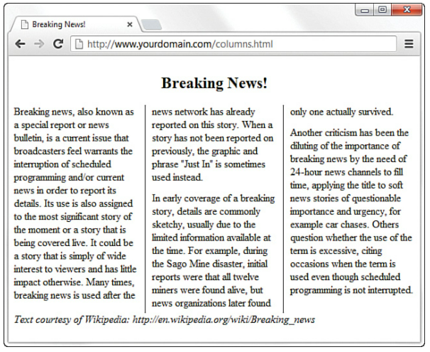

# HTML, CSS and JS Book notes

*OVERALL PROGRESS CONTINUE WITH LESSON 4 (from the top)*  
*NOTE PROGRESS CONTINUE WITH LESSON 3 (from the top) after finishing the TO DO*

## LESSON 1

### Key Points

- Hypertext Markup Language (HTML), Cascading Style Sheets (CSS) and JavaScript (JS).

- HTML generates the structure, CSS creates the look, and JavaScript controls the behavior of the pages.

- Web content delivery involves request(s) being made from the web browser to the web server and the server sending responses back to web browsers. Fewer calls to server the better performance.

- Web hosting providers (most established is Bluehost: www.bluehost.com).

- Testing with multiple browsers (Safari, Chrome, Firefox, Edge, Opera).

- File Transfer Protocol (FTP) Client to transfer web conetent to web server.

### Document Root

The document root of your web server is the directory that is designated as the top-level directory for your web content — the starting point of the directory structure (same way that Git has a document root). It's the trailing slash in the domain URL. 

> For example, if your domain is yourdomain.com and your URL is http://www.yourdomain.com/, the document root is the directory represented by the trailing slash (/) at the very end. It is the place where the web server begins looking for files requested by the web browser.

For a file to be accessible from the web server it has to be in the document root or any of it's sub-directries. If it's outside of the document root it will be unaccessible from any URL.

> For example if you place a sample.html file in the document root, you can access it from: http://www.yourdomain.com/sample.html. If you place the sample.html file in a subdirectory of document root you would access it from: http://www.yourdomain.com/newdirectory/sample.html

### Using an index.html file

- The index.html file is typically the default file for any directory in a web server. 
- It enables users to access http://www.yourdomain.com/newdirectory/ without using a trailing filename.

> For example, with an index file either will land on Apple’s iPhone informational page:
http://www.apple.com/iphone/  
http://www.apple.com/iphone/index.html

If there were no index.html page (the name of the index.html file was different) in the iphone directory and it dissallowed directory browsing then you would get a “Directory Listing Denied” error.

Make sure the document root and all its sub-directories contain an index.html file.

## LESSON 2

### Six tags every HTML page requires

```HTML
<!doctype html>
<html>
	<head>
		<meta>
		<title></title>
	</head>
	<body></body>
</html>
```

- Some HTML tags have two parts. An opening tag and a closing tag. For example, `<body>` Some Text `</body>`.

- Some have only 1 part (also called an empty tag). Adding the / in the empty tags used to be a requirement but that's no longer the case in HTML5. `<meta>` is an empty tag in the above example.

- You can specify additonal attributes in tags, for example charset in the `<meta>` tag like `<meta charset="utf-8">`.

### Basic strcuctural HTML tags

```HTML
<p></p> - paragraph (closing </p> tag is optional); skips a line between paragraphs
<hr> - horizontal rule & line break
<br> - line break
<h1></h1> - heading 1 
<h2></h2> - heading 2
<h3></h3> - heading 3
```

- You should use the heading tags (`<h1>`, `<h2>`, `<h3>` etc.) to keep tight control over content hierarchy; do not use headings as a way to achieve a particular look because that’s what CSS is for. HTML tags define what the content is rather than how it looks.

### Basic semantic HTML tags

```HTML
<header></header> - introductory info, usually contains <h1>, <h2>, <h3> etc. tags but not necessarily
<footer></footer> - supplementary info, copy right, author of article etc.
<nav></nav> - for navigational elements (primary & secondary, table of contents etc.)
<section></section> - generic or thematically related info, higher level than <p>
<article></article> - complete / standalone body of work, higher level than <section>
<aside></aside> - helper text, definitions, quotes, note, additional explanation etc.
<address></address> - address information, often contained within a <footer> element
```

Tags can be nested within each other and repeated multiple times to convey structure and semanting meaning.

> For example, you can have a `<body>` tag containing a `<header>`, `<nav>` and `<article>` tags. An `<article>` tag containing `<header>` and `<section>` tags and a `<section>` tag containing `<header>` and `<p>` tags.

### Flowchart for HTML5 sectioning

  
*Source: http://html5doctor.com/downloads/h5d-sectioning-flowchart.png*

- Other HTML tags:

```HTML
<ol></ol> - ordered list
<ul></ul> - unordered list
<li></li> - list item; used within <ol> or <ul> tags to list each item
<a></a> - used to create a hyperlink to another page or a location within the same page
```

### Basic HTML template

```HTML
<!doctype html>
<html lang="en">
	<head>
		<meta charset="utf-8">
		<title>Your Title</title>
	</head>
	<body>
		<header>
			<h1>Your Header</h1>
		</header>
		<section>
			<p>Your paragraph</p>
		</section>
	</body>
</html>
```

*Find template file [here](template.html)*

## LESSON 3

- In CSS you can specify an HTML tag (referred to as Selector).
- In curly braces you can specify one or multiple Style Properies (for example, font-size) followed by colon and its value (for example, 10pt).
- Each style property and value pair has to be semicolon delimited.

```CSS
h1 {font-size: 10pt; color: black;}
```

- You can save the above CSS code in a separate file with a .css extension. The resulting file is called an external style sheet. 

- To link an external style sheet to an HTML document, include a `<link>` tag in the `<head>` section of each HTML document. Both attributes `rel` and `href` are required within a `<link>` tag.
	- Attribute `rel` specifies the relationship between the current document and the linked document. There are 14 other possible values other than `"stylesheet"`.
	- Attribute `href` specifies the location of the linked document.

```HTML
<head>
	<meta charset="utf-8">
	<title>Your Title</title>
	<link rel="stylesheet" href="styles.css">
</head>
```

### Style properties in CSS can be grouped into two categories:

- Layout properties - Properties that affect the positioning of elements on a web page, such as margins, padding, and alignment.

- Formatting properties - Properties that affect the visual display of elements in a website, such as the font type, size, and color.

### Layout properties

- The `display` property is one if the most popular layout properties.
- It has five basic values among others: `block`, `list-item`, `inline`, `inline-block` and `none`.
	> For example, `display: block;`.
- You control the dimensions of the rectangular area for an element with the `width` and `height` properties.
- The values for `width` and `height` properties can be specified in different units of measurement: `in`, `cm`, `em`, `mm`, `%`, `px`, `pt` and `rem`
	> For example, `width: 200px;`

### Formatting properties

- The properties for formatting the border are one if the most popular formatting properties.
- Types of border properties: `border-width`, `border-color`, `border-style`, `border-left`, `border-right`, `border-top`, `border-bottom` and `border`
	> For example, `border-style: solid;`.  
	> Note, the `border-style` property has 9 other possible values other than `solid`.

- Other popular formatting options include:
	- Border radius: `border-top-left-radius`, `border-top-right-radius`, `border-bottom-left-radius`, `border-bottom-right-radius` and `border-radius`.
	- Element background color: `background-color`.
	- Element text color: `color`.
		> For example, `background-color: #999999;` or `color: rgb(0,0,255);`
	- Text indentation and alignment: `text-align` and `text-indent`.
	- Font related properties: `font-family`, `font-size`, `font-style` and `font-weight`.
	- `font` lets you set many font style properties at once instead of using the more specific property declarations above.
	- `line-height` sets the height of each line of text.
	- `text-decoration` is useful for turning off link underlining; simply set it to `none`. The values of `underline`, `overline`, and `line-through` are also supported.
	- `padding` (and the more specific `padding-left/right/top/bottom`) adds padding to the element

> Note: Length measurements in CSS are defined as fixed or relative. Fixed lengths - such as `in`, `cm`, `mm`, `px` or `pt` - do not change size, while relative lengths - such as `em`, `%`, `ch`, `vw`, `vh` or `rem` - can change.
>
>Best practices recommend that you use relative font sizes (such as rem or em) rather than fixed font sizes (such as inches or points) so that your designs scale more gracefully.

### Using Style Classes and IDs

- In the example at the start of [LESSON 3](#lesson-3) the style rules would apply to all `<h1>` headings:

```CSS
h1 {font-size: 10pt; color: black;}
```

- If you want different kinds of `<h1>` headings for use in your documents you create a style class by specifying a tag followed by a dot and a descriptive class name (any name).

```CSS
h1.silly {font-weight: 36pt; font-family: Comic Sans;}
h1.serious {font-weight: 36pt; font-family: Arial;}
```

- You can then assign that class to target HTML tags using the `class` attribute:

```HTML
<h1 class="silly">Party Time!</h1>
<h1 class="serious">Investor Information</h1>
```

- If you want to create a universal class that is not tied to one specific tag you can simply omit the tag in the CSS class definition allowing you to assign that class to any tag:

```CSS
.emphasis {font-weight: bold;}
```

- A style class can be resued across pages any number of times per page. Style IDs can also be resused across pages but only once per page.

- A style ID can be defined the same way a style class is defined except using a pound sign (#) instead of a dot.

```CSS
h1#silly {font-weight: 36pt; font-family: Comic Sans;}
h1#serious {font-weight: 36pt; font-family: Arial;}
```

- You can then assign that ID to target HTML tags using the `id` attribute:

```HTML
<h1 id="silly">Party Time!</h1>
<h1 id="serious">Investor Information</h1>
```

### Internal Style Sheets and Inline Styles

- There are two alternatives to using an external style sheet: Internal Style Sheet and Inline Styles.

- An Internal Style Sheet involves enclosing CSS code between `<style>` and `</style>` tags in the `<head>` of an HTML document.

```HTML
<head>
	<meta charset="utf-8">
	<title>Some Page</title>
	<style>
		h1 {font-size: 10pt; color: black;}
	</style>
</head>
```

- An Inline Style involves embedding the CSS code within an individual element (tag) using the `style` attribute.

- Use `<span>` to modify the style of any portion of text that is to appear in the middle of a sentence or paragraph without any line break.

```HTML
<p style="color:green;">
	This text is green, but <span style="color:red;">this text is red.</span> Back to green again, but...
</p>
<p>
	...now the green is over, and we're back to the default color for this page.
</p>
```

- You can think of cascading style effects as starting with an external style sheet, which is overridden by an internal style sheet, which is overridden by inline styles.

- Using an external style sheet is the best practice though.

- You can link multiple external style sheets via multiple `<link>` tags to the same document, but from performance standpoint fewer sheets are better because of fewer calls to the server.

> CSS validation tool: https://jigsaw.w3.org/css-validator/

## LESSON 4

- Four places where you can place JavaScript in HTML
	- In the `<body>` of the page
	- In the `<head>` of the page
	- Within an HTML tag, also known as Event Handler
	- An external JavaScipt file

- Overall best pracrice is to have an external JS file and place a link to that file in the `<head>` of the page. This doesn't apply to Event Handlers though which you need to use within the HTML tags.

```HTML
	<head>
		<meta charset="utf-8">
		<title>Your Title</title>
		<script src="js/scripts.js"></script>
	</head>
```

> Note, because in this case you're linking to an exernal JS file, anything between the `<script>` and `</script>` tags is ignored and can be left blank. 

- Below is an example of an Event Handler attached to a button elemnt:

```HTML
<button type="button"
onclick="alert('You clicked the button.')">
Click Me!</button>
```

- Below example creates a JS function that you can store in an external JS file that returns the local time in hours, minutes and secods.

```JS
window.onload = function() {
	now = new Date();
	hours = now.getHours();
	mins = now.getMinutes();
	secs = now.getSeconds();
document.getElementById("TimeVal").innerHTML = hours + ':' + mins + ':' + secs;
}
```

- You can then return the value in, for example, a paragraph with in the `<body>` of an HTML page: 

```HTML
<p>Your local time is: <span id="TimeVal"></span></p>
```

## LESSON 5

- HTML validator: https://validator.w3.org/
- CSS validator: https://jigsaw.w3.org/css-validator/

> When you use a validator, it’s best to review the problems in the order in which they appear. Often, fixing one error will cause a lot of the following errors listed to disappear.

- Use Developer Tools in the browser to inspect and debug code

- The "Debugging JavaScript Using Developer Tools" section had an example of debugging JS using Breakpoints, Step Over, Step Into and Step Out which could be useful.

- In JS use console logging to output specific strings at different points throughout your script. You can log to the Console by inserting code like the following in your JavaScript and then review these strings in the Console panel as the script executes:

```JS
console.log("Some string.");
```

## LESSON 6

- Working with special charcters reference: https://www.webstandards.org/learn/reference/charts/entities/namedentities/
- Using `<b>` and `<i>` tags in HTML should be avoided, use CSS instead (inline or in external file) especially for underlined or strikethrough text

```HTML
<p style="font-weight:bold; font-style:italic;">This paragraph is bold and italic!</p>
```

- A few acceptable HTML tags for text formatting when you don't want to use CSS: `<sup>`, `<sub>`, `<em>`, `<strong>` and `<pre>`

- Every browser has a default serif font, sans-serif font, cursive font, monospace font, and fantasy font.

- You can use margin-left propery to achieve identatin, for example, for subheadings. Below defines a class attribute for div tag.

```css
div.indented {
	margin-left: 25px;
}
```

- When setting a font type, you can link to a font file that will render your preffered font regardless if the user has that font installed on his local machine or not. This is also the best pactice.

> Find fonts that are free to use: https://fonts.google.com/

- In google fonts there are two options `<link>` or `@import`. Both have to be included in the `<head>` section of the page.

- Under `<link>` section there might be multiple links but you only need to include the last one in the `<head>` setion.

```HTML
<link href="https://fonts.googleapis.com/css2?family=Open+Sans&display=swap" rel="stylesheet">
```

- Under `@imort` section there's only one link (the URL is the same under both sections) so you need to include that one in the `<head>` section.

```HTML
<style>@import url('https://fonts.googleapis.com/css2?family=Open+Sans&display=swap');</style>
```

- Regardless of the method chosen you can just refer to the font name in your CSS code now:

```css
font-family: 'Open Sans', sans-serif;
```

- If you open the link used in both of the methods above you'll notice that it just contains CSS code that contains a URL to a font file (with extension .woff2). 

- An alternative method is to not include anything in the `<head>` of the HTML page but to include the below definition in your CSS file that:
	- Links to the .woff2 URL directly
	- You download the .woff2 file and place it into your web directory and link to it that way

- Either way the syntax is the same:

```css
@font-face {
     font-family: 'Open Sans';
     src: url('URL or Link to the file on server');
}
```

- Then, just like before you can use the font:

```css
font-family: 'Open Sans', sans-serif;
```

- The style property to align text is `text-align:` with four possible values `left` (default), `right`, `center` and `justify`.

- Ordered lists `<ol></ol>` and unordered lists `<ul></ul>` both contain `<li></li>` tags that enclose each list item.

- Definition list (the third list type) `<dl></dl>` contain `<dt></dt>` tags that enclose each list definition term and `<dd></dd>` tags that enclose each list definition.

- You can nest lists within lists (nest means placing a tag that appears entirely within another tag) to show a hierarchy of information. You can also achieve a visual appearance of indentation this way but you can also achieve indentation using CSS, so don't let it be the main reason you do it.

- When you nest unordered lists browser will default on `disc` for level 1, `circle` for level 2 and `square` for level 3. However, you can be explicit and override `list-style-type:` using the `style` attribute in the list definition (in `<ul>` tag) or even for each individual list item (in `<li>` tag).

- For ordered lists (in `<ol>` tag) these are the possible values for `list-style-type`: `upper-roman`, `lower-roman`, `upper-alpha`, `lower-alpha` or `decimal`.

```HTML
<ul style="list-style-type:circle;">
  <li>extra</li>
  <li>super</li>
  <li style="list-style-type:square;">special</li>
</ul>
```

- Creating a table
	- Basic tags:
		- Create a table definition using `<table></table>` tags.
		- Create a table row using `<tr></tr>` tags.
		- To create a column use `<td></td>` tags. Table information (text, images, other HTML tags) must be contained within these tags. Thus, each row must consist of at least 1 column. Each row in the table should have the same number of columns as the other rows.
		- Create table headings using the `<th></th>` tags. Most browsers will render information within these bold and centered by default.
	- Addition tags:
		- `<thread></thread>` tags to wrap the header row.
		- `<tfoot></tfoot>` tags to wrap the last row (for e.g. Totals).
		- `<tbody></tbody>` tags to wrap everything other than header or footer rows. Alternative to styling individual `<td>` cells.

- Defined table by default doesn't have any border styling applied. `border-collapse: collapse;` property (among others) is useful and makes all the borders of the `<table>`, `<tr>`, and `<th>` or `<td>` elements collapse into one shared border.

- Use the `width` style property on `<th>` element to control the size of the table. You can use percentages to, for example, fill the screen no matter of the screen size. Or use a fixed width unit like pixels.

- You can align the contents of table cells both horizontally and vertically with the `text-align` and `vertical-align` style properties to any `<tr>`, `<td>`, or `<th>` tag.
	- The possible values for `vertical-align` property: `top`, `middle`, `bottom`, `text-top`, `text-bottom`, and `baseline`.
	- The possible values for `text-align` property: `center`, `left`, or `right`.

- Spanning is the same as merging cells in Excel forcing a cell to stretch across more than one row or column of a table.

- The `colspan` attribute causes a cell to span multiple columns; `rowspan` has the same effect on rows.

- You can give an entire table or each individual row or even each individual cell in a table its own background using `background-color` or `background-image`.
> For example, `background-image:url(leaves.gif);`

- to add some space between the borders of the cells themselves, you can use the `border-spacing` property.

- Using tables for layouts is a bad practice. Use CSS instead.

- Below is a good example of how to center and span the title of an article, break the paragraphs in the article into 3 columns separated by vertical lines, and span the footer. 

```css
article {
	column-count: 3;
	column-gap: 21px;
	column-rule-width: 1px;
	column-rule-style: solid;
	column-rule-color: #000;
}

h1 {
	text-align: center;
	column-span: all;
}

p {
	margin-top: 0px;
	margin-bottom: 12px;
}

	footer {
	column-span: all;
}
```



## LESSON 7

- The forward slash `(/)` is always used to separate directories in HTML. Don’t use the backslash `(\)` which is normally used in the Windows operating system. However, command prompt will accept path if you use `(/)` instead of `(\)` as well.

- All web filenames should be lowercase (Linux is case sensitive but Windows is not). And never use spaces, use underscore or dash instead.

- Four types of addresses
	- Relative-root addresses. Relative to the domain you're currently browsing and thus doesn't require protocol type or domain name. The root directory itself is represented by `(/)`.  
	For example, `/docs/assets/utensils-solid.svg`
	- Relative addresses. Relative to whatever directory the file is in to link from one file to another.  
	For example, from the perspective of index.html file a link to CSS syle sheet would look like `css/styles.css`
		- Use the double dot command `(..)` to go one step back in the path.   
		For example, if you're in `C:\Users\matis` and want to get to git-learning directory then `cd ../../Source/git-learning`
	- Absolute address (or fully qualified domain name). Includes protocol and domain name.  
	Example, http://www.yourdomain.com/index.html
	- Local absolute address. Doesn't work and should never be used.  
	For example, `C:\Source\lab1-web\docs\assets\utensils-solid.svg`

- Use the `id="idname"` attribute within any HTML tag to turn it into an anchor. This is where the user will end up after clicking on the anchor link created by the `<a>` tag.

- Tag `<a></a>` is used to create a hyperlink to an external webpage, another page within the same domain or to a named anchor point. The hyperlink created by the tag is applied to content nested between the opening and closing `<a>` tags.
	- Link to external webpage: `<a href="https://www.apple.com/">Apple Offical Website</a>`
	- Link to internal page: `<a href="somedir/file.html">Learn More</a>`
	- Link to an anchor wihtin same page (assuming a tag with attribute `id="creadits"` exists somewhere): `<a href="#credits">Credits</a>`

- When you link to a file, like a word document or pdf the browser will either attempt to display it or it will prompt the user to download it. To force a download you can specify `download` attribute.  
For example, `<a href="myPDFfile.pdf" download>my PDF file</a>`

- From the four types of addresses above you can use the first two when linking from within the same domain. But when you want to create an external link, you have to use the absolute address.

- However, you can still link to named anchors on external pages or other internal pages.  
For example, `<a href="http://www.yourdomain.com/subdirectory/product.html#photos">`

- You can also use the `<a>` tag to link to emails so when the user clicks on the link it will be opened in their default mail app with the "To:" field already populated.  
For example, `<a href="mailto:you@yourdomain.com">you@yourdomain.com</a>`

- You can even pre-populate other fields like subject, body, cc, bcc etc. Note the single question mark (?) between the email and the list of variables. Values assigned to variables using the (=) and the separation of variable and value pairs using the (&).  
For example, `<a href="mailto:you@yourdomain.com?subject=email subject&body=email message&cc=someone@domain.com&bcc=someone_else@domain.com">you@yourdomain.com</a>`

- You can force links to open in a new browser window by specifying a `target` attribute. You can pass two types of values to the target attribute:
	- `"_blank"` which is special value that will open the link in a new windows without a name.
	- `"any_name"` you can give the new window any name which the link will open in and you can re-use that name for subsquent links to open in the same window if you don't want each of them to open in a new, blank window of their own.  

	For example, `<a href="/some/file.html" target="_blank">Open a Window!</a>`

- You can also give links a title that will appear in a tooltip when user hovers the link uing the `title` attribute. You can also use the title attribute as a CSS style hook to reference all links with title attribute.  
For example, `<a href="https://apple.com/iphone" title="go to official apple website">Check out the new iPhone!</a>`.  
And to reference in CSS, `a[title] { /* put styles here */ }`.

- The default color and decoration for links on web is blue and purple with an underline. Using CSS seudo-class (a class that describes styles for elements that apply only in certain circumstances) you can style links however you want.

- There are 5 CSS link seudo-classes:
	- `a:link` has not been visited
	- `a:visited` has been visited
	- `a:hover` when hovered over
	- `a:focus` when in focus (e.g. when using tab on keyboard)
	- `a:active` when is being clicked and not released yet

```css
a {
   font-weight: bold;
   text-decoration: none;
}
a:link {
   color: #6479A0;
}
a:visited {
   color: #cccccc;
}
a:hover, a:focus, a:active {
   color: #e03a3e;
}
```

- You're not limited to changing only the above styles, you can change anything, for example, font-family, font-size etc.

- You can also create style classes following the convention `selector.class:pseudo-class`.  
For example, a class just for footer links would be `a.footerlink` and `a.footerlink:hover` etc.

- You can use graphics as links (instead of using text as links) by putting an `` tag between the opening `<a>` and closing `</a>` tags.

- Clarification: `<a>` tag links to anchors using anchor name with `(#)` sign in front of it. You define an anchor using the `id` attribute. And even though you can put the `id` attribute in the `<a>` tag itself as well, it's generally not something one would do and it would be confusing. So it's best to include the `id` attribute in any other tag (making it the anchor) so the `<a>` tag can create a link to it (aka. an anchor link).  
For example, `<anytag id="credits">` and then `<a href="#credits">About the Authors</a>`.

## LESSON 8

- Use a small color palette; Focus on 3 or 4 main colors, with 1 or 2 complementary colors at most.

- To chage the background of a webpage put `style="background-color:blue;"` inside the `<body>` tag or in the style sheet rule for the body element.

- The hexadecimal color format is `#rrggbb`, in which `rr`, `gg`, and `bb` are two-digit hexadecimal values for the red (`rr`), green (`gg`), and blue (`bb`) components of the color.

- There are 256 combinations of two-digit hexadecimal values: 0–9 and a–f, paired up. Each two-digit component has a decimal value ranging from 0 (no color) to 255 (full color). `ff` is the maximum and `00` is the minimum for each component.
	- `#ffffff` - white
	- `#000000` - black
	- `#ff0000` - true red
	- `#00ff00` - true green
	- `#0000ff` - true blue

- The RGB color format is `rgb(red,green,blue)` and similar to hexadecimal just written in base-10 numbers (decimal) rather than base-16 (hexadecimal). 

- Just like with hexadecimals, each RGB component has a decimal value ranging from 0 (no color) to 255 (full color). Therefore 255 is the maximum and 0 is the minimum for each component.
	- `rgb(255,255,255)` - white
	- `rgb(0,0,0)` - black
	- `rgb(255,0,0)` - true red
	- `rgb(0,255,0)` - true green
	- `rgb(0,0,255)` - true blue

- All hexadecimal values have an RGB equvalent. So whatver color you can express with hexadecimals, you can translate into RGB.

- RGBa is RGB with alpha transparency which allows you to set the opaqueness or transparency of a color. RGBa format is `rgba(red,green,blue,transparency)` where the `transparency` value is a decimal between 0 and 1 (0 being fully transparent and 1 being fully opaque).

- Three most common applications of color in CSS: background color, text color and border color:
	- `background-color: #ffffff;`
	- `color: #000000;`
	- `border-color: #ff0000`

> In CSS you can’t designate a border as a color without also having a width and type.

- Image compression basic idea is that repeating patterns or large areas of the same color can be squeezed when the image is stored on a disk. This makes the image file much smaller and allows it to be transferred faster over the Internet. The web browser then restores the original appearance of the image when the image is displayed.

- 85% quality and 15% compression is a good rule of thumb.

- When you resize (scale) an image, you want the aspect ratio to be preserved to prevent it from squishing out of shape. You should never resize an image to be larger than what you started with. 

- Use the same image at several sizes for responsive web design.

- Use JPEG for web (or PNG if you need transparent background). PNG is superior to GIF.

- To embed an image on the website use the `` tag (`` is an empty tag, meaning it doesn't have a closing tag).  
For example, ``
	- Both `src` and `alt` are mandatory attributes.
	- The `alt` attribute is intended to serve as an alternative to the image if a user is unable to view the image either because it is unavailable or because the user is using a text-only browser or screen reader

 - Unless you're using a dedicated image hosting provider specifically for this purpose, always save images and other assets on your own webserver and use local file reference paths like in the example above instead of linking to someone elses server like ``.


- To improve load times, you can specify the exact image size in CSS or through the style property. The size speified doesn't have to match the actual size, the browser will stretch/reduce the image accordingly.  
For example, `` 

- The best way to adjust the dimensions of your images is to set `width` to a percentage of the container and `height` to auto to ensure that the image will fit in the design width and the aspect ratio will remain the same as the original size.  
For example, `style="width:100%; height:auto;"`.

- The new `<picture>` tag might be a better alternative for responsive web design discussed in Lesson 17.

- Just like with text, the `text-align` property also works with images. The posible values are `left`, `right` and `center`. You can also wrap text around an image from the left or right side using `float` property with possible `left` and `right` values respectively. 

- To control how the text and images line up vertically use the `vertical-align` property.
	- To line up the top of an image with the top of the text on the same line use `text-top` value.
	- To line up the bottom of an image with the bottom of the text on the same line use `text-bottom` value.
	- To line up the bottom of an image with the baseline of the text use `baseline` value (this is the default assumed value).
	- To line up the top or bottom of an image with the overall top or bottom of a line of elements regardless of text use `top` and `bottom` values respectively.
	- To line up the middle of an image with the overall vertical center of everything on the line use `middle` value.

- You can create image thumbnails where upon clicking on the thumbnail it re-directs to the full sized image. You can achieve this by turning images into links (linked images) by nesting the `` tag inside the opening and closing link tag `<a>`.  
Note, the must be a way to do this so it doesn't re-direct to a different page and just pops open in larger size without leaving the page.

```html
<div class="imageleft">
	<a href="http://www.flickr.com/photos/nofancyname/614253439/">
		
	</a><br>click image to enlarge
</div>
```

- Linked images will have a blue/purple border around by default. You might want to include `style="border:none;"` in any `` tag within a link.

- You can use background images to act as a wallpaper in a container element so the content appears on top of this underlying design. The basic CSS properties that work together to create this are:
	- `background-color` - Hexa or RGB value. If image is transparent or doesn't load, user will see this color instead.
	- `background-image` - The actual image. Value `url('imagename.png')`.
	- `background-repeat` - Repeat image. Values `repeat` (default; x and y), `repeat-x`, `repeat-y` and `no-repeat`.
	- `background-position` - initial placement of image, relative to its container. `top-left/center/right`, `center-left/center/right`, `bottom-left/center/right` and specifix pixel and percentage placements.

- You can combine all four of the above attributes into one, for example:

```css
body {
   background: #ffffff url('imagename.gif') no-repeat top right;
}
```

- To customize the appearance of bullet-point lists and display an image instead of the standard filled-disc bullet have the following CSS definition:

```css
ul {
  list-style-type: none;
  padding-left: 0;
  margin-left: 0;
}

li {
  background: url(mybullet.gif) left center no-repeat
}
```

- To create an image map you need to use `<map></map>` tags and nest an `<area>` tag for each region of the image inside it. You then need to link to the actual image in the `` tag that contains a `usemap` attribute.
	- In the `<map>` tag you need to specify the `name` attribute which will also be referenced in the `usemap` attribute (prefixed with `#`) in `` tag.
	- Each `<area>` tag must contain `shape` and `coords` attributes. Three possible `shape` values are `rect`, `circle` and `poly`. Attribute `coords` required x,y coordinates of the upper-left corner followed by the x,y coordinates of the lower-right corner for `rect`.  For `circle` x,y center point followed by the radius in pixels. For `poly` list the x,y coordinates of all the corners in a connect-the-dots order. In the `<area>` tag also specify an `href` attribute for location to which the region links, as well as additional `alt` and `title` attributes.

Compete code:
```html

<map name="fruit-map">
	<area shape="rect" coords="47,114,142,202" href="https://en.wikipedia.org/wiki/Orange_(fruit)" alt="orage" title="link to orange wiki">
	<area shape="rect" coords="151,114,246,202" href="https://en.wikipedia.org/wiki/Cherry" alt="cherry" title="link to cherry wiki">
	<area shape="rect" coords="259,113,354,201" href="https://en.wikipedia.org/wiki/Apple" alt="apple" title="link to apple wiki">
</map>
```

Notes: continue from "Linking to Multimedia Files".

---  

### Links:

- http://www.toptal.com/designers/colorfilter - color blindness checker
- https://webaim.org/resources/contrastchecker/ - color contrast checker
- http://paletton.com/ - for picking color schemes
- http://www.w3.org/TR/SVG/types.html#ColorKeywords - standard color names
- http://www.angelfire.com/super/badwebs/main.htm - poor website example
- http://www.adobe.com/ - creative tools
- http://www.gimp.org/ - free graphics program
- http://guides.lib.utexas.edu/copyright - copyright crash course
- https://pixabay.com/ - copyright-free photos (creative commons)
- http://clipart.com/ - stock images for small fee
- http://www.coreldraw.com/ - alternative to GIMP
- https://pixlr.com/ - alternative to GIMP
- https://flyingmeat.com/acorn/ - mac-only alternative to GIMP
- http://www.toptal.com/designers/subtlepatterns/ - free background images
- https://boutell.com/mapedit/ - image maps
- http://www.image-maps.com/ - image maps
- http://www.w3.org/TR/media-source/ - video editing from the web

Continue reading from Lesson 9.  