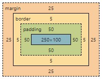

## LESSON 9

- Four core CSS properties:
  - `margin` and `padding` - adding space around elements
  - `align` and `float` - placing elements in relationship to others

### Margin

- `margin` adds space outside the element. You can specify margin for each side individually using `margin-top/right/bottom/left` properties or by using the `margin` shorthand property.

- If you use the shorthand `margin` property, you can list the size for each margin like this `margin: 15px 15px 15px 15px;` (where the order of evaluation is clockwise: top, right, bottom, left).
  - If you specify just one value, for example `margin: 15px`, it applies the size to all four margins.
  - If you specify two values, the first value is for top and bottom and the second is for left and right margins.
  - If you specify three values, the first is for top, the second is for left and right and the third is for bottom.

- `margin` is calculated based on the containing element. You have to be especially mindful if you specify it in percentages.  
  > For example, if you set the `margin-left` property of an element within the body to 25%, the left margin of the element will end up being 25% of the width of the entire page. If you then set the `margin-left` property of an element within that element to 25% as well, it will be 25% of whatever that original 25% was calculated to be.

- The `<body>` element by default will have a margin (8px). This will cause elements to not be flush with the browser window even if you've specified no margin around those elements. To avoid this you have to specify the below in your style sheet.

```css
body {
  margin: 0px;
}
```

- If you have two bordered elements stacked on top (or along side) each other with no margin between them, there will be an appearance of a double border, which might not be desirable in many situations. To correct this, you have to make the borders of the sides of the elements that touch to be half the width so they appear to have the same width as all the other sides.

- If you have two elements stacked on top (or along side) each other with 30px `margin` all around them, then the gap between the elements will not be 60px but 30px as `margin` collapses automatically to the widest specified margin. This also means that if you specify the `margin` of the top element to be 40px and the `margin` of the bottom element to be 30px then the resulting gap will be 40px.

- The border, similar to `margin`, adds space outside the element. Which means that if you have an element that's 100px wide, and you have a 10px border all around it, the actual width of the element is 120px.
  - This means that, if you wanted the element below it to start where the first one ends, you would need to define a `margin-left: 120px` for the second element.
  - If the first element also has a 10px `margin` all around it, then you would need to define a `margin-left: 130px` for the second element for it to start where the first one ends.

### Padding

- `padding` adds space inside the element. Just like with `margin`, you can specify padding for each side individually using `padding-top/right/bottom/left` properties or by using the `padding` shorthand property.

- And just like with `margin`, if you use the shorthand `padding` property, you can list the size for each padding like this `padding: 15px 15px 15px 15px;` (where the order of evaluation is clockwise: top, right, bottom, left).
  - If you specify just one value, for example `padding: 15px`, it applies the size to all four sides.
  - If you specify two values, the first value is for top and bottom and the second is for left and right sides.
  - If you specify three values, the first is for top, the second is for left and right and the third is for bottom side.

- Because the padding of an element appears within the element’s content area, it assumes the same style as the content of the element, including the background color.

- If you have an element with a width of 50px and height of 30px and you set a 5px `padding` all around it then the content area will remain 50px wide and 30px high but the entire element will now take up 60px in width and 40px in height. If there are any borders defined, they will add to the total rendered width and height as well. In essence, `padding` stretches the footprint of the element outwards leaving the content area intact.

- If you look at the examples from margins.html you'll notice there's always a little bit of space between, for example, DIV #1 text and the top border. That space is not padding, because if you highlight the text you'll see that the area of the highlight is flush with the top border of the element. This shows that there is 0 padding defined from the top and that little bit of space is around the text itself.

- In the padding.html I wrapped the DIV #1/2/3/4 text in `<span>` tags and made the background white. This way you can see exactly how the padding affects the space between the text and the border. You can also wrap it in `<p>` tag but "browsers typically display the block-level elements like `<p>` with a newline both before and after the element" thus creating an artificial space between the text and border that's not defined by padding.

- To center an image or a block of content in your design, the easiest way is to change the horizontal (left and right) margins to `auto`, like `margin-left: auto; margin-right: auto;` or use the margin shorthand `margin: 0 auto;`. This works only on elements that have a width set and that width is smaller than the current container.

- Elements only float horizontally not vertically, thus`float` property has only two possible values `left` and `right`. You can float all sorts of elements in the layout not just images.

- Play around with the float.html a bit more to understand `float` better. In essence, when you assign a `float: left` to an element, that element will float left and in doing so will overlap with existing elements if they are not floating as well (or stack side by side one another if they are both floating). Either way it will free up space for text to wrap around from the right.

- To control floating you can use the `clear` property with possible values `left`, `right`, `both`, `none` or `inherit`. For example, specifying `clear:left;` in an element ensures that no content appears to the left of a floating element.

- Remember: `margin` collapses around elements to the widest specified margin. `border` and `padding` do not collapse, however, if you specify half the width for the `border` you can make it appear is if the borders collapse.

---

### Appendix:

> A Block-level element occupies the entire horizontal space of its parent element (container), and vertical space equal to the height of its contents, thereby creating a "block".

The above explains why you see different white background area size in padding.html between using `<span>` and `<p>` and also why there's extra space at the top not defined by padding when using `<p>`.

Link: https://developer.mozilla.org/en-US/docs/Web/HTML/Block-level_elements

## LESSON 10

- Every element in HTML is considered a “box,” whether it is a paragraph, a `<div>`, an image, or something else. The box model describes the way in which every HTML block-level element has the potential for a border, padding, and margin and, specifically, how the border, padding, and margin are applied.



- In the box model, to know the true or rendered height and width of an element, you have to take into account all the elements of the box model.
  - The total width the element takes up on the page is calculated:  
  width + padding-left + padding-right + border-left + border-right + margin-left + margin-right
  - The total height the element takes up on the page is calculated:  
  height + padding-top + padding-bottom + border-top + border-bottom + margin-top + margin-bottom

- This means, for example, if you only have 250px horizontal space you cannot assign all 250px to the element itself, you have to balance and adjust the width based on how much `border`, `padding` and `margin` you want.

- There's a related family of properties which is not part of the box model called `outline` (as well as `outline-width`, `outline-style`, `outline-color`, `outline-offset`). An outline is a line drawn outside the element's border. Outline may overlap other content and is NOT a part of the element's dimensions; the element's total width and height is not affected by the width of the outline. It's usually used to make an element stand out.

- The box model can easily stretch out well beyond the given amount of space (especially when using relative units like percentages, rems or ems). For example, if you place two `<div>` elements with the below styles on a page, they won't fit next to each other and the second element will float to the next line. Only at 49% width they can fit on the same line.

```css
div {
   width: 50%;
   height: 300px;
   float: left;
   padding: 0.25rem;
   border: solid 1px aqua;
}
```

- This is because, like mentioned before, the space the elements take up includes the padding, border, and margin.

- To manage this, there is a `box-sizing` property with two possible values:
  - `content-box` - The `width` and `height` values are assigned to the content box only, and padding and border are added afterward. This is the default.
  - `border-box` - Any defined `padding` and `border` are included inside the assigned `width` and `height` values.

- Thus, if you add `box-sizing: border-box;` to the above CSS example, both `<div>` elements will fit on the same line at 50%.

- All elements have a default `display` property (which in some cases can be changed). There are three possible values for the `display` property: `block`, `inline` and `inline-block`. 
  - Elements whose default property is `block` are, for example, `<p>` and `<div>`. They are automatically placed on a new row, and `width` and `height` can be explicitly defined.
  - Elements whose default property is `inline` are, for example, `<span>` and `<code>`. They are placed on the same row, and `width` and `height` cannot be explicitly defined (is defined automatically by the amount of content they contain).
  - Elements whose default property is `inline-block` are, for example, ``. Like inline elements they are placed on the same row but you can also explicitly define the `width` and `height`.

- To position elements on the page use `position` property with possible values:
  - `relative` - The element is positioned relative to its normal position in the document flow. 
  - `absolute` - The element is positioned relative to its parent element. Absolute positioned elements are removed from the normal flow, and can overlap elements. Allows you to be pixel-exact.
  - `fixed` - The element is positioned relative to the browser window instead of any containing elements, which means it always stays in the same place even if the page is scrolled.
  - `static` - Default. Just like `relative` the element is positioned relative to its normal position in the document flow, however, unline `relative` it's not affected by the `top`, `right`, `bottom` and `left` rules.
  - `sticky` - (use `-webkit-sticky` for support in Safari). A sticky element toggles between `relative` and `fixed`, depending on the scroll position. It is positioned relative until a given offset position is met in the browser window - then it "sticks" in place (like `position: fixed`).

- There are four properties that create an offset based on the value of `position` property (all except `static`).
  - `left` - The left position offset.
  - `right` - The right position offset.
  - `top` - The top position offset.
  - `bottom` - The bottom position offset.  

For example, `left: 25px;`

> Note, you cannot set both horizontal or both vertical position properties on the same element. If you set both the `left` and the `right` positions (or both `top` and `bottom`) on an element, the `left` and `top` properties will take precedence in left-to-right documents. So at most you can only specify `top` and `left`.

- The `z-index` style property enables you to set the order of elements with respect to how they stack on top of each other. Default value is 0. The assigned value can be both positive and negative integers. The element with higher index value appears on top of the element with a lower index value. If both overlapping elements have the same index value, then the element that appears in the HTML document last will be on top.

- Regardless of the `z-index` value you set for a style rule, an element displayed with the rule will always appear on top of its parent.

- Think about a webpage in terms of rows (horizontal lines). A block-level element always starts on a new line and takes up the full width available. If you specify a width, it will take up that width, if you don't, it will take up the entire width allowed by it's parent container, for example, `<body>`.
  - Text is part of that flow, and because text is typically contained in other block-level elements like `<p>`, the `float` property controls how text flows around an element using either `left` or `right` values.
  - You can prevent text from flowing next to an element by using the `clear` property, which you can set to `none`, `left`, `right`, or `both`.
  - The `overflow` property handles overflow text, which is text that doesn’t fit within its rectangular area; this can happen if you set the `width` and `height` properties of an element too small. Possible values are:
    - `visible` - Default. Will automatically enrage the element to fit the text.
    - `hidden` - Leaves the element the same size and hides the overflow text.
    - `scroll` - Leaves the element the same size and introduces scrollbars to the element to see the text.

## LESSON 11

- Specific list-related styles include:
  - `list-style-image` - for placement of an image as a list-item marker
  - `list-style-position` - possible values `inside` or `outside` (default) indicating the place of the list-item marker
  - `list-style-type` - the type of list-item marker itself

- You can also use `margin`, `padding`, `color` and `background-color` on your lists to achieve s different look. You can use these properties on the parent list element type (`<ul>` or `<ol>`) and the individual list items `<li>` themselves.

- The `<ul>` or `<ol>` creates a box in which the individual list items `<li>` are placed. Browsers by default always add 40px `padding` to the left side of `<ul>` or `<ol>`.

- Changing the `list-style-position` to `inside` will display the bullet inside the list item box indenting the text even more and any text that cannot fit on the same line will go to the next line and "wrap" around the bullet.

- Notice in the lists.html example, that the width assigned to the `<ul>` element is 100px. Any additional text contained within the list items `<li>` will stretch the entire list box defined by `<ul>` down vertically but will never stretch it horizontally past the 100px.

- In fact, any `padding` or `margin` applied to list items `<li>` will reduce the size of the content box as needed so that the `margin` + `border` + `padding` never exceeds 100px width. 

- Notice, how adding `margin` to second list item makes the background color of the list `<ul>` appear (as expected) and how `padding` was used in the third list item to make sure the bullet aligns with the second list item.

- See css-image-map.html on how to create an alternative Image Map using CSS. Using CSS is arguably a better practice and provides more flexibility than using the HTML `<map>` element. 
  - Note, the picture is the background of the list element itself.

- It's considered good practice to use list elements to create navigation bars for websites. See horizontal-nav.html, vertical-nav.html and vertical-nav-sub.html. The exmaples included techniques learned in previous lessons to style lists to look like navigation bars.

- The biggest difference in styling vertical vs. horizontal bars is the use of `display: block;` property for vertical navigation and `display: inline;` for horizontal navigation (note typo in the book).

---

### Appendix:

Useful resource for CSS-based list navigation: https://www.w3schools.com/css/css_navbar.asp

## LESSON 12

Notes from Lesson 12.  
Reading from Lesson 13.  

---
### Appendix:

https://wordpress.org/themes/ - examples of liquid layouts  
http://www.csszengarden.com/ - same as above  
http://gs.statcounter.com/screen-resolution-stats/ - to find popular resolutions  
https://flexboxzombies.com/ - a game for learning CSS fexible boxes  
https://gridbyexample.com/examples/ - for learning CSS grid layout

**Relevant sections in W3Schools:**  
Under CSS:  
- CSS Website Layout
- CSS Flexbox
- CSS Responsive (and all submodules)
- CSS Grid  

Under HTML:  
- HTML Layout
- HTML Responsive

Comment: In the book they referred to fixed, liquid and hybrid layouts. I think the liquid/hybrid section in this book is simply the "CSS float property" technique under HTML Layout section in W3Schools.