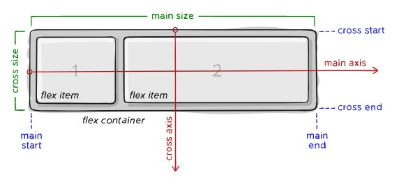

## LESSON 9

- Four core CSS properties:
  - `margin` and `padding` - adding space around elements
  - `align` and `float` - placing elements in relationship to others

### Margin

- `margin` adds space outside the element. You can specify margin for each side individually using `margin-top/right/bottom/left` properties or by using the `margin` shorthand property.

- If you use the shorthand `margin` property, you can list the size for each margin like this `margin: 15px 15px 15px 15px;` (where the order of evaluation is clockwise: top, right, bottom, left).
  - If you specify just one value, for example `margin: 15px`, it applies the size to all four margins.
  - If you specify two values, the first value is for top and bottom and the second is for left and right margins.
  - If you specify three values, the first is for top, the second is for left and right and the third is for bottom.

- `margin` is calculated based on the containing element. You have to be especially mindful if you specify it in percentages.  
  > For example, if you set the `margin-left` property of an element within the body to 25%, the left margin of the element will end up being 25% of the width of the entire page. If you then set the `margin-left` property of an element within that element to 25% as well, it will be 25% of whatever that original 25% was calculated to be.

- The `<body>` element by default will have a margin (8px). This will cause elements to not be flush with the browser window even if you've specified no margin around those elements. To avoid this you have to specify the below in your style sheet.

```css
body {
  margin: 0px;
}
```

- If you have two bordered elements stacked on top (or along side) each other with no margin between them, there will be an appearance of a double border, which might not be desirable in many situations. To correct this, you have to make the borders of the sides of the elements that touch to be half the width so they appear to have the same width as all the other sides.

- If you have two elements stacked on top (or along side) each other with 30px `margin` all around them, then the gap between the elements will not be 60px but 30px as `margin` collapses automatically to the widest specified margin. This also means that if you specify the `margin` of the top element to be 40px and the `margin` of the bottom element to be 30px then the resulting gap will be 40px.

- The border, similar to `margin`, adds space outside the element. Which means that if you have an element that's 100px wide, and you have a 10px border all around it, the actual width of the element is 120px.
  - This means that, if you wanted the element below it to start where the first one ends, you would need to define a `margin-left: 120px` for the second element.
  - If the first element also has a 10px `margin` all around it, then you would need to define a `margin-left: 130px` for the second element for it to start where the first one ends.

### Padding

- `padding` adds space inside the element. Just like with `margin`, you can specify padding for each side individually using `padding-top/right/bottom/left` properties or by using the `padding` shorthand property.

- And just like with `margin`, if you use the shorthand `padding` property, you can list the size for each padding like this `padding: 15px 15px 15px 15px;` (where the order of evaluation is clockwise: top, right, bottom, left).
  - If you specify just one value, for example `padding: 15px`, it applies the size to all four sides.
  - If you specify two values, the first value is for top and bottom and the second is for left and right sides.
  - If you specify three values, the first is for top, the second is for left and right and the third is for bottom side.

- Because the padding of an element appears within the element’s content area, it assumes the same style as the content of the element, including the background color.

- If you have an element with a width of 50px and height of 30px and you set a 5px `padding` all around it then the content area will remain 50px wide and 30px high but the entire element will now take up 60px in width and 40px in height. If there are any borders defined, they will add to the total rendered width and height as well. In essence, `padding` stretches the footprint of the element outwards leaving the content area intact.

- If you look at the examples from margins.html you'll notice there's always a little bit of space between, for example, DIV #1 text and the top border. That space is not padding, because if you highlight the text you'll see that the area of the highlight is flush with the top border of the element. This shows that there is 0 padding defined from the top and that little bit of space is around the text itself.

- In the padding.html I wrapped the DIV #1/2/3/4 text in `<span>` tags and made the background white. This way you can see exactly how the padding affects the space between the text and the border. You can also wrap it in `<p>` tag but "browsers typically display the block-level elements like `<p>` with a newline both before and after the element" thus creating an artificial space between the text and border that's not defined by padding.

- To center an image or a block of content in your design, the easiest way is to change the horizontal (left and right) margins to `auto`, like `margin-left: auto; margin-right: auto;` or use the margin shorthand `margin: 0 auto;`. This works only on elements that have a width set and that width is smaller than the current container.

- Elements only float horizontally not vertically, thus`float` property has only two possible values `left` and `right`. You can float all sorts of elements in the layout not just images.

- Play around with the float.html a bit more to understand `float` better. In essence, when you assign a `float: left` to an element, that element will float left and in doing so will overlap with existing elements if they are not floating as well (or stack side by side one another if they are both floating). Either way it will free up space for text to wrap around from the right.

- To control floating you can use the `clear` property with possible values `left`, `right`, `both`, `none` or `inherit`. For example, specifying `clear:left;` in an element ensures that no content appears to the left of a floating element.

- Remember: `margin` collapses around elements to the widest specified margin. `border` and `padding` do not collapse, however, if you specify half the width for the `border` you can make it appear is if the borders collapse.

---

### Appendix:

> A Block-level element occupies the entire horizontal space of its parent element (container), and vertical space equal to the height of its contents, thereby creating a "block".

The above explains why you see different white background area size in padding.html between using `<span>` and `<p>` and also why there's extra space at the top not defined by padding when using `<p>`.

Link: https://developer.mozilla.org/en-US/docs/Web/HTML/Block-level_elements

## LESSON 10

- Every element in HTML is considered a “box,” whether it is a paragraph, a `<div>`, an image, or something else. The box model describes the way in which every HTML block-level element has the potential for a border, padding, and margin and, specifically, how the border, padding, and margin are applied.


- In the box model, to know the true or rendered height and width of an element, you have to take into account all the elements of the box model.
  - The total width the element takes up on the page is calculated:  
  width + padding-left + padding-right + border-left + border-right + margin-left + margin-right
  - The total height the element takes up on the page is calculated:  
  height + padding-top + padding-bottom + border-top + border-bottom + margin-top + margin-bottom

- This means, for example, if you only have 250px horizontal space you cannot assign all 250px to the element itself, you have to balance and adjust the width based on how much `border`, `padding` and `margin` you want.

- There's a related family of properties which is not part of the box model called `outline` (as well as `outline-width`, `outline-style`, `outline-color`, `outline-offset`). An outline is a line drawn outside the element's border. Outline may overlap other content and is NOT a part of the element's dimensions; the element's total width and height is not affected by the width of the outline. It's usually used to make an element stand out.

- The box model can easily stretch out well beyond the given amount of space (especially when using relative units like percentages, rems or ems). For example, if you place two `<div>` elements with the below styles on a page, they won't fit next to each other and the second element will float to the next line. Only at 49% width they can fit on the same line.

```css
div {
   width: 50%;
   height: 300px;
   float: left;
   padding: 0.25rem;
   border: solid 1px aqua;
}
```

- This is because, like mentioned before, the space the elements take up includes the padding, border, and margin.

- To manage this, there is a `box-sizing` property with two possible values:
  - `content-box` - The `width` and `height` values are assigned to the content box only, and padding and border are added afterward. This is the default.
  - `border-box` - Any defined `padding` and `border` are included inside the assigned `width` and `height` values.

- Thus, if you add `box-sizing: border-box;` to the above CSS example, both `<div>` elements will fit on the same line at 50%.

- All elements have a default `display` property (which in some cases can be changed). There are three possible values for the `display` property: `block`, `inline` and `inline-block`. 
  - Elements whose default property is `block` are, for example, `<p>` and `<div>`. They are automatically placed on a new row, and `width` and `height` can be explicitly defined.
  - Elements whose default property is `inline` are, for example, `<span>` and `<code>`. They are placed on the same row, and `width` and `height` cannot be explicitly defined (is defined automatically by the amount of content they contain).
  - Elements whose default property is `inline-block` are, for example, ``. Like inline elements they are placed on the same row but you can also explicitly define the `width` and `height`.

- To position elements on the page use `position` property with possible values:
  - `relative` - The element is positioned relative to its normal position in the document flow. 
  - `absolute` - The element is positioned relative to its parent element. Absolute positioned elements are removed from the normal flow, and can overlap elements. Allows you to be pixel-exact.
  - `fixed` - The element is positioned relative to the browser window instead of any containing elements, which means it always stays in the same place even if the page is scrolled.
  - `static` - Default. Just like `relative` the element is positioned relative to its normal position in the document flow, however, unline `relative` it's not affected by the `top`, `right`, `bottom` and `left` rules.
  - `sticky` - (use `-webkit-sticky` for support in Safari). A sticky element toggles between `relative` and `fixed`, depending on the scroll position. It is positioned relative until a given offset position is met in the browser window - then it "sticks" in place (like `position: fixed`).

- There are four properties that create an offset based on the value of `position` property (all except `static`).
  - `left` - The left position offset.
  - `right` - The right position offset.
  - `top` - The top position offset.
  - `bottom` - The bottom position offset.  

For example, `left: 25px;`

> Note, you cannot set both horizontal or both vertical position properties on the same element. If you set both the `left` and the `right` positions (or both `top` and `bottom`) on an element, the `left` and `top` properties will take precedence in left-to-right documents. So at most you can only specify `top` and `left`.

- The `z-index` style property enables you to set the order of elements with respect to how they stack on top of each other. Default value is 0. The assigned value can be both positive and negative integers. The element with higher index value appears on top of the element with a lower index value. If both overlapping elements have the same index value, then the element that appears in the HTML document last will be on top.

- Regardless of the `z-index` value you set for a style rule, an element displayed with the rule will always appear on top of its parent.

- Think about a webpage in terms of rows (horizontal lines). A block-level element always starts on a new line and takes up the full width available. If you specify a width, it will take up that width, if you don't, it will take up the entire width allowed by it's parent container, for example, `<body>`.
  - Text is part of that flow, and because text is typically contained in other block-level elements like `<p>`, the `float` property controls how text flows around an element using either `left` or `right` values.
  - You can prevent text from flowing next to an element by using the `clear` property, which you can set to `none`, `left`, `right`, or `both`.
  - The `overflow` property handles overflow text, which is text that doesn’t fit within its rectangular area; this can happen if you set the `width` and `height` properties of an element too small. Possible values are:
    - `visible` - Default. Will automatically enrage the element to fit the text.
    - `hidden` - Leaves the element the same size and hides the overflow text.
    - `scroll` - Leaves the element the same size and introduces scrollbars to the element to see the text.

## LESSON 11

- Specific list-related styles include:
  - `list-style-image` - for placement of an image as a list-item marker
  - `list-style-position` - possible values `inside` or `outside` (default) indicating the place of the list-item marker
  - `list-style-type` - the type of list-item marker itself

- You can also use `margin`, `padding`, `color` and `background-color` on your lists to achieve s different look. You can use these properties on the parent list element type (`<ul>` or `<ol>`) and the individual list items `<li>` themselves.

- The `<ul>` or `<ol>` creates a box in which the individual list items `<li>` are placed. Browsers by default always add 40px `padding` to the left side of `<ul>` or `<ol>`.

- Changing the `list-style-position` to `inside` will display the bullet inside the list item box indenting the text even more and any text that cannot fit on the same line will go to the next line and "wrap" around the bullet.

- Notice in the lists.html example, that the width assigned to the `<ul>` element is 100px. Any additional text contained within the list items `<li>` will stretch the entire list box defined by `<ul>` down vertically but will never stretch it horizontally past the 100px.

- In fact, any `padding` or `margin` applied to list items `<li>` will reduce the size of the content box as needed so that the `margin` + `border` + `padding` never exceeds 100px width. 

- Notice, how adding `margin` to second list item makes the background color of the list `<ul>` appear (as expected) and how `padding` was used in the third list item to make sure the bullet aligns with the second list item.

- See css-image-map.html on how to create an alternative Image Map using CSS. Using CSS is arguably a better practice and provides more flexibility than using the HTML `<map>` element. 
  - Note, the picture is the background of the list element itself.

- It's considered good practice to use list elements to create navigation bars for websites. See horizontal-nav.html, vertical-nav.html and vertical-nav-sub.html. The exmaples included techniques learned in previous lessons to style lists to look like navigation bars.

- The biggest difference in styling vertical vs. horizontal bars is the use of `display: block;` property for vertical navigation and `display: inline;` for horizontal navigation (note typo in the book).

---

### Appendix:

Useful resource for CSS-based list navigation: https://www.w3schools.com/css/css_navbar.asp

## LESSON 12 

### Fixed layout

- Fixed layout (or fixed-width layout) is a layout in which the page is set to a specific width. This is typically controlled using a master wrapper element (like `<div>`) that contains all the other elements and their content.

- Give semantic IDs to your wrapper element and other elements, like "main" that imply structure and not design. 

- With a fixed width layout if the resolution is smaller than the allowed width you will encounter scrollbars, if the resolution is greater then you will encounter empty spaces.
  - Centering vs. aligning content. If you center and the resolution is too small, both sides will be cut off. If you align it to the left then only right side will be cut off.

### Liquid layout

- Liquid layout (a.k.a. fluid layout) is a layout that doesn't use a specified width in pixels. It might be encloused in a master wrapper element that uses a percentage width. The idea behind a liquid layout is that it can be perfectly usable and still retain the overall design aesthetic, even if the user has a very small or very wide screen.

### Fixed/liquid hybrid layout

- Fully liquid layouts can be hard to achieve, and in some cases perhaps undesirable. A good compromise is a hybrid layout which contains elements of both types of layouts. For example, you could have a fluid layout that includes fixed-width content areas either within the body area or as anchor elements (such as a left-side column or as a top navigation strip).

### Liquid layout with three fixed-width columns

- HTML is only for the structure and the content. All the actual styling that makes a layout fixed, liquid, or hybrid happens in the style sheet. Even the IDs of the elements should not imply any design (position of format), only semantic information like "secondary_content" etc.

- The `min-width` property sets a threshold below which it will stop shrinking the page and will introduce a horizontal scroll bar. This prevents the page from getting to the point of "breaking" where content is no longer ligible and elements start to overlap in unpredictable ways.

- The `max-width` property on the other hand lets the element expand up to a point and then stop.

- Note that creating fixed/liquid/hybrid layouts using floats and negative margins like it was described in this section is highly discouraged, not a good practice and a remnant of the past.

- To see hybrid float layout with negative margins see the hybrid-layout.html and float-layout.html pages. The former is the actual exercise from the book.

### CSS table layout technique

- By using CSS tables, you can create layouts similar to how web designers might have created them using actual tables two decades ago. However, the CSS `display: table;` property is not the same as a semantic HTML `<table>` tag. This means you can convert any element, like `<div>`, into a table to build your layout.

- The value `table` is just one value of 10 table-related possible values.

- Since the CSS `display: table;` doesn't get rendered into an actual structural HTML table (which might otherwise cause issues with screen readers), it's safe to use for design purposes without breaking the best practices of HTML and CSS. 

- However, overall this technique is not widely used and is not considered standard or best practice like CSS Flexbox or CSS Grid. One big drawback is that to re-order columns, you need to structurally change your HTML. The order of columns ideally is something that CSS would take care of.

- Thus this method is for very niche purposes where you might want a table-like container but where the data is not actually tabular and serves as more of a design aesthetic. But again, you could probably use CSS Grid or Flexbox instead.

- One thing that the `display: table;` family of properties do that can be useful is allow you to center content vertically in the space. To do so simply add the `display: table-cell;` property to an element with an explicit height and then set `vertical-align` to `middle`.

- See the table-layout.html to see the example from the book. The HTML is the same as in hybrid-layout.html, just the CSS is different.

### CSS flexbox layout technique

- CSS Flexbox is a layout method for arranging items in rows or columns. Elements inside it flex - expand to fill additional space or shrink to fit into smaller spaces.

- The CSS Flexbox is not intended to be used for a full page layout, but rather for smaller page components and small-scale layouts. If you want a full page layout use CSS Grid instead.

  
*(displays flex container and flex items and the concept of main and cross axis, starting and ending points)*

- The flex layout properties can be assigned to either the parent element (flex container) or the child elements (flex items). This is where the properties discussed in this secion belong:

**Flex container:**
```
display:
flex-flow:
  flex-direction:
  flex-wrap:
justify-content: /*main axis*/
align-items: /*cross axis*/
align-content: /*multiple lines*/
gap:
  row-gap:
  column-gap:
```

**Flex items:**
```
flex:
  flex-grow:
  flex-shrink:
  flex-basis:
align-self: (overrides align-items)
order:
```

- The method allows you to place the items in a more flexible fashion, not strictly adhering the to normal flow of the page. Use the `display: flex;` property on a parent element (making it flex container) that will hold all the flex items in the layout. 

- The flex container is acting like a block-level element in terms of how it interacts with the rest of the page, but its children are laid out as flex items. 
  > Note: use `display: inline-flex;` to have the flex container act like an inline element instead of a block-level element. The children will be laid out as flex items the same way regardless.

- To control in what direction the flex items are laid out in use the `flex-direction` property with values:
  - `row` - Default. Flex items get laid out in a row in the direction your browser's default language works in (left to right, in the case of an English browser).
  - `column` - Flex items flow from top to bottom in a column.
  > Note: there are also `row-reverse` and `column-reverse` values.

See an example file illustrate points above flexbox0-mdn.html

- To control how flex items will wrap use the `flex-wrap` property with values:
  - `nowrap` - All flex items are laid out on one line (horizontal or vertical).
  - `wrap` - Flex items wrap to multiple lines (top to bottom).
  - `wrap-reverse` - Flex items wrap to multiple lines (bottom to top).

> Note: you can define both `flex-direction` and `flex-wrap` using the `flex-flow` shorthand property. In `flex-flow` shorthand first specify direction value then wrap value.

- To control how much space flex items take up inside the container use the `flex` shorthand property assigned to the flex item elements. `flex` is a shorthand for:
  - `flex-grow` - specifies how much of the remaining space in the flex container should be assigned to the item. The remaining space is the size of the flex container minus the size of all flex items' sizes together (returning a number > 0). If all sibling items have the same flex grow factor, then all items will receive the same share of remaining space, otherwise it is distributed according to the ratio defined by the different flex grow factors.
  - `flex-shrink` - spcifies how much excess space should be detracted from the item to fit it into the flex container. The excess space is the size of the flex container minus the size of all flex items' sizes together (returning a number < 0). If all sibling items have the same flex shrink factor, then all items will be detracted the same share of excess space, otherwise it is detracted according to the ratio defined by the different flex shrink factors.
  - `flex-basis` - specifies the initial main size of a flex item. It sets the size of the content box unless otherwise set with `box-sizing`. It's not a strict min or max, it's just an initial width before grow and shrink are applied.

See example files illustrate points above flexbox-wrap0-mdn.html and flexbox1-mdn.html.

- Control where the flex items sit on the main axis using `justify-content` property with values:
  - `flex-start` - Default. The items are placed at the start of the container, and any extra space is placed after all the items.
  - `flex-end` - The items are placed at the end of the container, and any extra space is placed before all the items.
  - `center` - The items are placed in the center of the container, and extra space is placed evenly at the start and end.
  - `space-between` - The items are evenly distributed on the line, with the first item placed flush at the start and the last placed flush at the end.
  - `spac-around` - The items are evenly distributed on the line, with the space before the first item and the space after the last item being half the space between the items.
  - `space-evenly` - The items are evenly distributed on the line, with equal space all around all items.

- Control where the flex items sit on the cross axis using `align-items` property with values:
  - `stretch` - Default. The items should stretch to fill the whole container while respecting `min-width` and `max-width` rules.
  - `center` - Items are centered along the cross axis.
  - `baseline` - Items are aligned so that their baselines align.
  - `flex-start` - The items are positioned at the start of the element (the top for horizontal and the left for vertical ltr layouts).
  - `flex-end` - The items are positioned at the end of the element (the bottom for horizontal and the right for vertical ltr layouts).

> Note, you can override the `align-items` property that's assigned to the flex container by using `align-self` property assigned to the individual flex item(s).

- If the items in the container are distributed across multiple lines, to control how any extra space between the lines will be distributed use the `align-content` property. Has no effect if you have only one line.
  - `stretch` - Default. Lines stretch to take up the remaining space.
  - `center` - Lines are placed in the center of the container, with extra space placed evenly before and after.
  - `flex-start` - Lines are placed at the start of the container, with extra space placed after.
  - `flex-end` - Lines are placed at the end of the container, with extra space placed first.
  - `space-between` - The lines are evenly distributed, with the first line placed flush at the start and the last placed flush at the end.
  - `spac-around` - The lines are evenly distributed, with the space before the first line and the space after the last line being half the space between the lines.
  - `space-evenly` - The line are evenly distributed, with equal space all around all lines.

- Flexbox items appear on the page in the same order in which they appear in the HTML, but with the `order` property, you can change that. The default value is `0`. Flex items with higher order values will appear later in the display order than items with lower order values. Flex items with the same order value will appear in the same order in which they appear in the HTML. You can also use negative numbers.  

- You can use the `order` property in creative ways to, for example, rank and disaply the best selling products at the top of the webpage based on database entries.  

- See flex-align0-mdn.html illustrate points above. 

> Note, there is also a `gap` property (shorthand for `row-gap` and `column-gap`), however, they are not as widely used in flexbox layouts as they are in grid layouts due to the prominance of alternatives discussed above.

- See complex-flexbox-mdn.html for complex nested flexbox layout example.
- For the example from the book see the flexbox-layout.html.

### CSS Grid layout technique

- CSS Grid Layout is a two-dimensional layout system for the web. It lets you lay content out in rows and columns and will typically have gaps between each row and column. It has many features that make building complex layouts straightforward.

- Basic terminology of CSS Grid:
  - Grid container - Parent element on which `display: grid` is applied.
  - Grid item - Child elements of the grid container.
  - Grid line - The dividing lines that make up the structure of the grid. They can be either vertical or horizontal.
  - Grid cell - Single unit of the grid. Space between two vertical and two horizontal grid lines.
  - Grid track - A row or a column. Space between two vertical or two horizontal grid lines.
  - Grid area - The total space surrounded by four grid lines. A grid area may be composed of any number of grid cells.
  - Gutters - Also known as gaps or alleys. The spacing between grid tracks.
  - Grid axis - Consists of block/column axis and inline/row axis.

- Use the `display` property to define the grid container element using two possible values:
  - `grid` - block-level grid.
  - `inline-grid` - inline grid.

- Declaring `display: grid` will not make the grid items immediately look any different. It gives you a one column grid, so your items will continue to display one below the other as they do in normal flow.

- To create columns use the `grid-template-columns` property. The property accepts a space delimited list of values. The number of values indicates the number of columns that will be created while the weight of the values indicate the width of the columns.

- CSS Grid introduces a completely new unit type `fr` which represents a fraction of the leftover space in the grid container. The `fr` unit distributes space proportionally (similar to how grow and shrink works in flexbox). For example:

```css
.container {
    display: grid;
    grid-template-columns: 2fr 1fr 1fr;
}
```

- The first track now gets `2fr` of the available space and the other two tracks get `1fr`, making the first track larger. You can mix `fr` units with fixed length units - in such a case the space needed for the fixed tracks is used up first; the remaining space is then distributed to the other tracks.

- To create gaps between tracks we use the `gap` property (shorthand for `column-gap` and `row-gap`).

- Use the CSS Grid-specific `repeat()` function to repeat track listings. The first value in the function is the number of time you want it repeated and the second value is the track lsiting. For example, instead of listing `grid-template-columns: 1fr 1fr 1fr;` you can do `grid-template-columns: repeat(3, 1fr);` instead. This is because CSS Grid is often defined by a dozen or more columns and this way it's easier to work with the layout.

- When you use `grid-template-columns` or `grid-template-rows` functions you create an explicit row or column grid. The implicit row or column grid is created when content is placed outside of the explicit grid. For example, you can create explicit column grid but as extra content is moved into rows it creates an implicit row grid.

- By default, tracks created in the implicit grid are `auto` sized, which in general means that they're large enough to accommodate their content. If you wish to give implicit grid tracks a size, you can use the `grid-auto-rows` and `grid-auto-columns` properties.

- The best practice is to use the CSS Grid-specific `minmax()` function which lets you set a minimum and maximum size for a track, for example, `minmax(100px, auto)`. The minimum size is `100px`, but the maximum is `auto`, which will expand automatically to accommodate more content.

- CONTINUE FROM https://developer.mozilla.org/en-US/docs/Learn/CSS/CSS_layout/Grids#as_many_columns_as_will_fit. EVERYTHING ABOVE IS DONE. EVERYTHING BELOW IS FROM THE BOOK.

- Then define the grid columns and rows with the `grid-template-columns` and `grid-template-rows` properties, both of which use space-separated lists of values.

- CSS Grid adds a new unit of measure `fr` which refers to the free speca in the container. The browser first removes any space taken by non-flexible items and then divides up the remaining space among the elements with `fr` units. For example, you might have a three-column layout with a 15% left column and the remaining columns taking up three-quarters and one-quarter of the remaining available space.
  - For example, `grid-template-columns: 15% 3fr 1fr;`.

- To make it easier, you can name different items using the `grid-area` property. For example, you might name your layout elements like:

```css
header { grid-area: header; }
footer { grid-area: footer; }
section { grid-area: main; }
aside { grid-area: sidebar; }
nav { grid-area: navigation; }
```

- Then you define your layout grid with the `grid-template-areas` property. You reference the names of a grid area in the cell in which you want them to display. If you repeat it, the content will span those columns or rows. And a period is an empty cell in the layout.

- Note, When you turn a container element into a grid container, the grid elements are only the immediate children of that container.

- For the example from the book see the grid-layout.html.

- In summary, do not do layouts using the fixed, liquid or hybdrid layouts using the floats and negative margins. Also do not use the CSS Table unless it's absolutely needed. Use CSS Grid for full page layouts. User CSS Flexbox for components and smaller-scale layouts. In general, it seems like nowadays web development is centered around Responsive Web Design (RWD) and mobile-first (which includes CSS Grid and Flexbox among other things).

---

### Appendix:

**Links in the book:**

https://wordpress.org/themes/ - examples of liquid layouts  
http://www.csszengarden.com/ - same as above  
http://gs.statcounter.com/screen-resolution-stats/ - to find popular resolutions  
https://flexboxzombies.com/ - a game for learning CSS fexible boxes  
https://gridbyexample.com/examples/ - for learning CSS grid layout

**Relevant sections in W3Schools:**  
Under CSS:  
- CSS Website Layout
- CSS Flexbox
- CSS Responsive (and all submodules)
- CSS Grid  

Under HTML:  
- HTML Layout
- HTML Responsive

Comment: In the book they referred to fixed, liquid and hybrid layouts. I think the liquid/hybrid section in this book is simply the "CSS float property" technique under HTML Layout section in W3Schools.

**Other relevant links:**
- https://developer.mozilla.org/en-US/docs/Web/CSS/inheritance#inherited_properties
- https://cssgridgarden.com/  
- https://developer.mozilla.org/en-US/docs/Learn/CSS/CSS_layout  
- https://developer.mozilla.org/en-US/docs/Web/CSS/CSS_Flexible_Box_Layout  
- https://developer.mozilla.org/en-US/docs/Web/CSS/CSS_Grid_Layout  

**Overflow and collapsing wrapper explanation:**
- The use of `overflow: hidden;` to prevent the wrapper element from collapsing if it contains only floats.  
A floating element doesn't contribute to the height of its wrapper element, because when you use `float` you remove the element from the normal flow of the page. By default, elements will be layed out in the "normal flow", meaning they will be positioned inside their wrapper element and take up space accordingly. Floating elements, because they are removed from the "normal flow" have their own special layout rules.
- There was a reddit thread that explained the above. This is also a useful link to understand the problem (though the solutions there are outdated): http://complexspiral.com/publications/containing-floats/

Useful explanations to the margin-right negative value phenomenon I've found so far:  
https://stackoverflow.com/questions/53184230/why-float-element-works-weird-with-negative-margin  
https://stackoverflow.com/questions/24651678/css-3-column-float-and-negative-margin-liquid-layout  
https://www.w3.org/TR/CSS22/visuren.html#float-rules (specifically rule 7) - it seems like it's not possible for the right edge to go more left than the actual width of the container thus even -infite would be the same as result.

CSS Table discussion: https://stackoverflow.com/questions/29229523/how-and-why-to-use-display-table-cell-css

## LESSON 13

This lesson focuses on more advanced techniques of controlling borders and backgrounds.

- The `background` shorthand CSS property sets all background style properties at once, such as color, image, origin and size, or repeat method.
  - Link: https://developer.mozilla.org/en-US/docs/Web/CSS/background

- The `border` shorthand CSS property sets an element's border. It sets the values of `border-width`, `border-style`, and `border-color`.
  - Link: https://developer.mozilla.org/en-US/docs/Web/CSS/border

> Note, you don’t need to specify the properties in a specific order when using the shorthard properties (with the exception below). You also don't need to include all properties, you can leave out the ones that are not relevant.  

- Notice the forward slash (/) in the book example when using the `background` shorthand property. The forward slash is required syntax for separating `background-position` and `background-size` values. This is to eliminate misinterpretation of the values specified. If you're going to specify both, then `background-position` has to come first, then the forward slash, then the `background-size`.

- Remember the CSS is all about cascading. To Define 3 borders the same and 1 different, you can do it like in the example below. Remember that in CSS more-specific styles trump more general ones the same way how styles applied locally trump styles applied in external style sheet.

```css
border: 2px solid aqua;
border-bottom: 5px dashed red;
```

- The `background` property is specified as one or more background layers, separated by commas. The order of the items correlates with the order of the layers: The first item is the top layer and on down through the backgrounds.

- The background property can be placed on any block-level HTML element, so we can add a `<div>` with the class box to the HTML
  - For example, `<div class="box"></div>`.

- The `background-origin` and `background-clip` properties lets you change what parts of the box the background covers. 
  - The `background-origin` property lets you change from which part of the box the background coverage starts. 
  - The `background-clip` property specifies whether the background will stop at content box or extend under the border or padding of the element. 
  - Use the following values with both origin and clip: `border-box`, `padding-box` and `content-box`.

- There a multiple different ways you can change the background sizes. You can use keywords or values (one or multiple). If you have multiple backgrounds, you can set their sizes by separating the values with commas:
  - Fox example, `background-size: 400px 400px, cover;`. The first background width and height are 400px and the second background is set to cover the entire container (might be stretched or cropped).

- Like with background, there are multiple different ways you can change the background positioning. The `background-position` property lets you define where the background will be drawn relative to the upper-left corner of the element. You can use the keywords `top`, `bottom`, `right`, `left`, and `center`. Or you can use two percentage or length values. One value moves the background right, and two values move it to the right and down. You can also offset from `top`, `bottom`, `right` and `left` followed by a unit.
  - For example, `background-position: top 2rem right 1rem;`.
  - Look into what is and how to use `calc()`.

- Use the `background-attachment` property to control the scrolling of the background using values:
  - `scroll` - will scroll with viewport but will remain fixed inside the container element.
  - `fixed` - will remain fixed in both. 
  - `local` - will scroll with both viewport and inside the container element.
  - See the background-scroll.html for an example from the book.

- You can use pseudo-class selectors to create alternating rows in the table. The best thing is that they are dynamic so you don't need to assign a different background manually for each row. It also means that if you add more rows to the table tomorrow, the rules will apply to the extra rows automatically without needing to modify anything.

- There are four pseudo-classes `:nth-child()`, `:nth-last-child()`, `:nth-of-type()` and `:nth-last-of-type()`. The first two select based on all child elements, the last two select based on element type (such as `<p>`, `<li>`, `<tr>` etc.).

- All four accept four types of values:
  - An integer value
  - `even` for even-numbered elements
  - `odd` for odd-numbered elements
  - A formula: `an+-b` where `a` is an ingeter value, `n` is a literal letter n, `+-` is an operator so either `+` or `-` and `b` is another integer value.
    - For example: Every other element, starting with the fifth one `:nth-child(2n+5)`
    - Or: Every sixth element, starting with the second one `:nth-child(6n+2)`

- To create zebra-stripe tables, you can just use the even or odd keywords. See index.html for an example.
  - CSS used: `tbody tr:nth-child(even) { background-color: #dfdfdf; }`

- There are two types of gradients: linear and radial. Gradients are created using the `background-image` property or the `background` shorthand. 
  - Linear gradients fade from one color to the next in a single direction. Create a linear gradient using the `linear-gradient()` expression.
    - List any number of colors comma separated
    - Add color stops
    - Indicate direction
  - Radial gradients start at a single point and emanate outward. Create a radial gradient using the `radial-gradient()` expression.
    - Specify shape (`circle` or `ellipse` - default).
    - Specify size (`closest-side`, `closest-corner`, `farthest-side` or `farthest-corner`).
    - Specify starting position using `at` followed by positiong keywords (`left`, `center`, `right`, `top` or `bottom`) or exact position in lengths or percentages. 
    - List any number of colors comma separated.
    - Add color stops.

- Use `border-radius` property to round the corners of elements. The property accepts one to four values. One value rounds all four courners the same radius and four values rounds each corner separately. See specification for more detail.

- See gradients.html for examples of gradients and rounded corners.

- You can create image borders, where the boarder is not just one solid color but a picture. You can define any picture as a border using the `border-image` shorthand property. The `border-image` combines 5 properties that define source, slice, width, outset and repeat.

- In order to create a repeating image, you need to create a 9 × 9 grid of the image (you can leave out the central image you you're not planning to use the `fill` value) and then slice the image with the slice property.

- See border-image.html for a very good example and the Mozilla documentation is excellent. It's where I found the example that I modified and used in the HTML.

- An `outline` is a line around visible objects on the web page that is designed to make the object stand out. Outline is different from `border` in three ways:
  - Outlines do not take up space (not part of the box model)
  - Outlines may be non-rectangular (especially if applied to inline elements; might display the contours of letters)
  - Browsers and other user agents often render outlines on elements when they are in the `:focus` state

- For accessibility reasons never use `outline: none;` or `outline: 0;`. 

- `outline` shorthand includes style, color and width properties. There's also a separate `outline-offset` propery that specifies how far from the edge of the border you want to draw the outline, default is 0 (can also be negative). See an example of outlines in gradients.html.

---

**Links in the book:**  

Reagrding "Alternating Background Colors", CSS3 structural pseudo-class selector tester: http://lea.verou.me/demos/nth.html  

## LESSON 14

### Using Transform property

- The CSS `transform:` property lets you transform an element by accepting the below transform functions:
  - `rotate()` - spins the element by angle (in degrees)
    - Specify units in `deg` (degrees). 
    - Accepts both positive and negative numbers.
  - `scale()` - resizes elements (smaller or bigger)
    - No unit. `0.5` represents half the current, `2` represents two times as large.
    - Specifying a single number will resize it both horizontally and vertically.
    - Accepts both positive and negative numbers. Negative values cause an element to scale in a mirror image way. For example, `transform: scalex(−1);` would display it in a morror way and `transform: scaley(−1);` would display it upside down.
  - `translate()` - moves the element in x, y direction to a new position
    - Specifying a single number will move it only horizontally. Specify a second number separated by comma will also move it vertically.
  - `skew()` - distorts along the x or y axis
    - Specifying a single number will skew it only horizontally. Specify a second number separated by comma will also skew it vertically.
    - Specify units in `deg` (degrees).
  - `matrix()` - combines all 4 above transform functions and gives you pixel-perfect control over how your elements are transformed. In other words, you can do with the `matrix()` function everything you can do with the above 4 functions separately.

> Note, most of the above functions have related 3D functions as well as x-axis, y-axis and z-axis functions.

- When you transform an element, the browser won’t change or move the surrounding elements. A transformed element can overlap and even hide other elements on the page.

- When you transform an element, it affects everything in that element. If you double the size of a 200 × 200 box with 15px padding with, for example, `transform: scale(2);`, it will display as 400 × 400 with 30px padding. The transformation applies to other styles on the element as well, such as font size, margins, borders, and outlines.

- See transforms.html to see an example of all 4 transform functions. Note that you can also combine multiple transform functions (separated by space) in the same `transform:` property. The order in which you place the functions in your CSS is the order in which they are applied. Changing the order could change how an element looks on the page.

- When you use the 3D functions remember two things:
  - Use the `perspective` property in the parent element to define the perspective from which the third dimension is viewed. This determines the intensity if the transformation (further away is less intense than up close). For example, `perspective: 40cm;`.
  - Elements that are transformed in 3D space will look no different than elements that have been transformed on a 2D plane unless you give them a frame of reference. Book used a blank container element with a border around each transformed element (Figure 14.5).

- The transform properties apply only to block-level elements and a few table elements. If you need to transform an inline element such as a `<code>` block, you should first add the `display: block;` or `display: inline-block;` style to it.

### Using Transition property

- Create animations using the `transition` shorthand property. It includes:
  - `transition-property` - specifies which CSS properties should transition
  - `transition-duration` - amount of time the transition will take
  - `transition-timing-function` - specifies the function used to determine how intermediate values in the animation are computed
    - Accepted values are `ease` (default), `ease-in`, `ease-out`, `ease-in-out` and `linear`. Define a custom timing function using the `cubic-brezier()` function.
  - `transition-delay` - defines when the transition will start

- The notation: `transition: property duration timing-function delay;`

- You can specify multiple properties in the same `transition` property separated by comma. For example, `transition: width 4s, height 2s;`

- In the transforms.html we were assigning transforms directly to elements and they were redered already transformed. If you want to create an animation where the object will be rendered with the originally defined values and then transition into a different state then you need to define a trigger, like a `:hover` state.

- Using this method you assign the `transition` directly to the element but place the `transform` (it doesn't have to be a `transform`, you can use any property like `width: 20px`) in the `:hover` state. The key is that whatever property you put in the trigger (e.g. `:hover` state) has to be referenced by thr `transition` property assigned to the element.

- In the `transition` property you can also use the keyword `all` that works as a shorthand to apply the transition to all properties that are meant to transition. This saves you time. In the example below, using `all` to avoid listing `transform` and `background-color` separately.

```css
#rotated {
  transition: all 1s ease;
}
#rotated:hover {
  transform: rotate(45deg);
  background-color: red;
}
```

- A full list of properties that can be transitioned or animated: https://developer.mozilla.org/en-US/docs/Web/CSS/CSS_animated_properties. Also, you should avoid transitioning to and from `auto`.

- In situations where you want to create a `transition` but there isn't an appropriate CSS selector you need to use JavaScript. For example, CSS has a `:hover` class but doesn't have a `:click` pseudo-class. 

- One way to do this is to define classes that you can assign when an element is clicked. You would have a class for the element itself and a class for when it’s clicked:

```css
div {
  width: 10rem;
  height: 10rem;
  background: #ff0000;
  transition: transform 3s linear;
}
div.clicked {
  transform: rotate(230deg);
}
```

- And then you use JavaScript to add and remove the `clicked` class. In the book they used jQuery so I will not even try it as I want to focus on vanilla JS.

- To see an animated version of the transformations in the transforms.html see the transitions.html (just removed the buttons). 

---

**Links in the book:**  

- Regarding `transform: matrix();` - http://angrytools.com/css-generator/transform/
- List of properties that can be transitioned - http://oli.jp/2010/css-animatable-properties/
- Interesting examples - http://leaverou.github.io/animatable/
- Reagarding `cubic-bezier()`; a tool to help build timing functions - https://matthewlein.com/tools/ceaser

## LESSON 15

- What was covered so far in Lessons 14 & 15:
  - CSS Transitions - start of CSS animation, very limited in scope
  - CSS Animations - goes beyond the two-frame state of transitions by adding keyframes and other features
  - JS Animations on HTML `<canvas>` - more powerful (though harder to learn) than CSS Animations
  - SVG Animations - was only briefly mentioned, no idea where it stacks on the list

> Note, that while JS on `<canvas>` is a lot more powerful than anything CSS-based, it's believed that CSS animations are faster than JS. So for some small interactions, transitions and animations CSS might be worth considering from the optimization point of view.

- The `<canvas>` HTML element can be used with the Canvas API or the WebGL API. WebGL is used for interactive 3D graphics, similar to what you would see in a video game. It has an interactive 3D plane and a camera perspective. WebGL is not for creating statistical charts or data visualisations. Or at least it would be an overkill to use it for such purpose. Canvas API provides the means for drawing 2D graphics via JavaScript. D3 uses Canvas API.

### Using CSS Animation

- CSS `animation` property lets you animate transformations in a standalone fashion. It doesn't require a trigger event to start the animation like `transition`. CSS `animation` consists of two things:
  - the styles that are animated
  - the keyframes that indicate the beginning and end states for each animation style.
  
- The `animation` shorthard property includes 8 sub-properties (the order doesn't matter). All have a `animation-` prefix: `delay`, `direction`, `duration`, `iteration-count`, `name`, `play-state`, `timing-function` and `fill-mode`.

- In order to use any of the properties above you first need to set up a `@keyframes` rule by establishing two or more keyframes in your CSS. With a keyframe, you define the state changes for an animation. For example:

```css
@keyframes myAnimation {
  from {
    transform: scale(0.5);
    background: red;
  }
  to {
    transform: scale(1);
    background: blue;
  }
}
```

- The above animation performs the same changes as the `transition` property. It contains two keyframes (the start and end keyframe) just like a `transition` property would, but it applies to the element automatically without needing a trigger.

- Keyframes use percentages to indicate the time during the animation sequence at which they take place. `0%` indicates the start of the animation sequence, while `100%` indicates the end state of the animation. The two states have special aliases: `from` and `to`. Both are optional. If `from`/`0%` or `to`/`100%` is not specified, the browser starts or finishes the animation using the computed values of all attributes.

- To understand this better, see animation2.html that translates the headline off the screen 100 pixels at the beginning (0%). The browser then animates the element to its final position automatically.

- The real power of `animation` comes with the ability to define more than two keyframes which you can optionally include describing intermediate steps between the start and end of the animation.

### The 8 animation sub-properties

- The `animation-duration` function is exactly the same as the `transition-duration` function and sets the amount of time the animation will take.

- The `animation-timing-function` is equivalent to the `transition-timing-function` and accepts the same exact values, including the `cubic-bezier()` function that defines the Bézier curve (FYI Chrome developer tools has a build-in cubic-bezier editor). Each of the standard functions has an equivalent `cubic-bezier()` function. You can use the function to create your own timing curves.

> In the animation3.html example you'll notice the use of the `calc()` function. If you position the element 100% left it's placed mostly offscreen. If you want it to be placed up against the left border, without going over, you need to use the CSS `calc()` function. You can use the `calc()` function to calculate the exact values from percentages in CSS.

- The `animation-delay` property is the same as the `transition-delay` property. 

- When you set a delay on your animations, you may notice that the animated elements do not behave as expected. This is because animations do not affect the element before the first keyframe is played or after the last one is played. You can change this behavior with the `animation-fill-mode` property using values:
  - `none` - The animation does not affect the styles of the element either before or after running.
  - `forwards` - The animated element keeps the styles set by the last keyframe.
  - `backwards` - The element gets the styles set by the first keyframe, including during the `animation-delay`.
  - `both` - Both the forwards and backwards values are applied.

- Use `animation-iteration-count` to change how many times the animation repeats. The values can be numeric or a keyword `infinite`. 

- Use `animation-direction` to change the way the animation is played and repeated. There are four possible values:
  - `normal` - Default. Plays the animation from start to finish.
  - `reverse` - Plays the animation backward, from finish to start.
  - `alternate` - Plays the animation first from start to finish and then in reverse and so on until the iteration count is reached.
  - `alternate-reverse` - Plays the animation first from finish to start and then in reverse and so on until the iteration count is reached.

- Use `animation-play-state` property to play or stop an animation using values `paused` or `running`. One way to let a user stop an animation is by adding it to a pseudo-class such as `:hover` like:

```css
.ball:hover {
  animation-play-state: paused;
}
```

- Use `animation-name` property to define the `@keyframe` rule to use for the animation. This name is a custom identifier for each animation. You can also use the keyword `none` to turn off the animation.

### Using Canvas for drawing shapes

- The HTML `<canvas>` element creates a rectangular region on a web page where you can draw anything you’d like by using JavaScript.

- When you use the `<canvas>` element you want to specify the `width` and `height` of the canvas area and give it an `id` so you can reference it in JS.
  - For example, `<canvas id="myCanvas" width="350" height="450"></canvas>`

> You can assign `width` and `height` in CSS (as you typically should) but due to how the image is scaled during rendering it might end up being distorted. It is better to specify your canvas dimensions by setting the `width` and `height` attributes directly on the `<canvas>` elements, either directly in the HTML or by using JavaScript.

- In order to draw on a `<canvas>` element, you must pass the string `2d` to the `getContext()` method. Otherwise, your `<canvas>` element will not display anything.

```js
<script>
  var canvas = document.getElementById('myCanvas');
  var context = canvas.getContext('2d');
</script>
```

> See canvas.html as an example on how to draw basic shapes like rectangles.

- To draw a circle you use the `arc()` method:  
  - `arc(x, y, radius, startAngle, endAngle, clockwise);`

- Arcs in the `<canvas>` element are measured in radians, not degrees. In JavaScript, you can convert degrees to radians with the following expression:
  - `var radians = (Math.PI/180)*degrees;`

- Like circles, lines and polygons are drawn using paths. There are five methods to draw and use paths:
  - `beginPath()` - creates a path on a canvas.
  - `closePath()` - draws a straight line from the current point to the start. It doesn’t do anything when a path is already closed or on a path with only one point.
  - `stroke()` - draws an outline of a path.
  - `fill()` - fills in the shape of a path.
  - `moveTo()` - draws nothing but moves the drawing position to a new location on the canvas.

> When drawing a path you should always specify the starting position of the path with the `moveTo()` command. The `<canvas>` element will treat your first construction that way, regardless of what the method actually is, and this will prevent you from getting surprising results.

> If you don’t close the path and choose to fill the shape using the `fill()` method, the shape will close automatically, with a straight line from the last point on the path to the first point. You do not need to close the path with the `closePath()` method.

- Notice in the canvas.html how when you draw a triangle using the `fill()` method you don't need to draw the third line from the second point back to origin and you don't need to close the path, because the `fill()` method does both of those things automatically. If I would use `stroke()` method instead, however, I would need to use the `closePath()` method which would then draw a line back to the origin and close the path.

### Using Canvas for drawing images

- In order to display an image inside a `<canvas>` element, you need to reference an image object as a source file and then draw the image onto the canvas with the `drawImage()` method. To reference an image you have two choices:
  - Access an existing image on the page (in an `` element)
  - Create a new image with JavaScript

- The examples in canvas-imgs.html and canvas-img-sprite.html use the latter option:

```js
var loadimg = new Image();
loadimg.src = "assets/loading-sprite.png";
```

- The `drawImage()` method contains the following parameters:
  - `context.drawImage(clipx, clipy, clipwidth, clipheight, gox, goy, gowidth, goheight);`

- `clipx` and `clipy` indicate the x,y coordinates where the clipping is to start from. `clipwidth` and `clipheight` indicate the area of the clipping. `gox` and `goy` indicate the x,y coordinates where the clipped image is to be placed. `gowidth` and `goheight` indicate the size of the clipped image (remember, shrinking down might be ok but you shouldn't stretch the image beyond it's original size).

### Creating a CSS sprite animation

- To create a sprite animation, you first create one large image composited of multiple smaller images (of same size) that are stiched together side by side. The idea is that each smaller image is going to serve as an individual frame in the animation. 

- You then write a loop function that contains the `drawImage()` method that crops and displays the relevant frame. Each time the function iterates it increments the current frame pushing forward the starting point of the next crop. 

- Check the canvas-img-sprite.html, it's thoroughly commented.

- Overall JavaScript-based animation using `<canvas>` is far more superior to CSS Animation in terms of possibilities. CSS Animation is good for basic transition and it might be more performant than JS (though the performance advantage CSS has I think is probably negligeable if there's an advantage at all). 

- Remember, CSS Transitions are CSS Animations, just more limited in scope and that they can do. Use CSS Animation if you need more granular control over the animation keyframes and if you need the animation to have more than just a start and end state.

---

**Links in the book:**  

A tool that helps you build curves: http://cubic-bezier.com/  
The example of animated dog: https://htmljenn.com/mckinley-talking.html  
A tool to build SVG graphics and animate them: https://inkscape.org/en/  