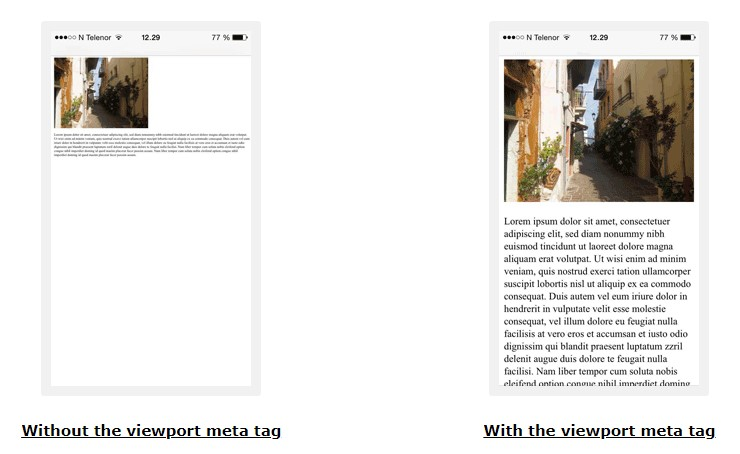

## LESSON 16

This lesson focused a lot on the theory of Responsive Web Design (RWD). It also recapped some of the points from previous lessons. Regardless, the key takeaways are listed below.

- In the first half of 2010's before the widespread adoption of CSS3 most web sites had separate (but kind of linked) desktop and mobile site. Remember, when you would visit a site from your phone there would be an option "request a desktop site" and it would open a desktop site that you would then have to zoom in to fully see etc. That has changed with RWD where a single site is built and maintained but dynamically adapts based on the size of the screens it's viewed and different characteristics.

> RWD doesn’t look at the device but rather looks at the features. For instance, an RWD site that checks for Retina display doesn’t care if the device is an Apple iPhone 4S or a Samsung Galaxy S9. It just notices that the screen can handle high-resolution Retina images and displays them.

- Think about the BBC website. When you hold your iPad vertically, the view is very similar to what you would see on your mobile (perhaps with just a bit more room for navigation items), but when you turn it horizntally, it looks the same as on a desktop PC with side bars appearing etc. The site just dynamically adapts, expands and shrinks, depending on the resolution of the screen at any given moment. It uses CSS media queries to define fluid grids, variable font sizes, and flexible images.

> As Sir Tim Berners-Lee said in the July 1996 Technology Review: “Anyone who slaps a ‘this page is best viewed with Browser X’ label on a Web page appears to be yearning for the bad old days, before the Web, when you had very little chance of reading a document written on another computer, another word processor, or another network.”

- Remember about the separation of content from design and function and how HTML, CSS and JS play their very distinct and separate roles in this.

- Remember the common HTML sectioning elements like `<article>`, `<aside>`, `<section>`, `<nav>`, `<header>` and `<footer>`.

- Remember to use semantic HTML elements that are not sectioning elements like `<address>`, `<time>`, `<code>`, `<blockquote>`, `<cite>`, `<q>`, `<abbr>` etc.

- Remember the basic attributes `id` and `class`. The `id` gives a unique (per page) name to an element that can be referenced in CSS using the pound sign (`#`). This means that the styles you assign to that `id` will apply only to that one element on the page. You can also link to an `id`, for example, `<article id="main">` and then `<a href="#main">`. You can also use it as a hook for scripts using `getElementById()`. You can assign multiple to an element classes separated by space in the `class` attribute.

---

**Links in the book:**  

HTML validator: https://validator.w3.org/  
CSS validator: https://jigsaw.w3.org/css-validator/  
You can search for JS validators online (though validating JS is more difficult)  

## LESSON 17

- Search engines penalize sites that are not mobile friendly. There are certain things you need to get right when desigining a site so it is mobile friendly:
  - Do not use Flash
  - Configure viewport
  - Avoid fixed-width designs
  - Media queries for serving images
  - Relative unit sizes
  - Relative font sizes (relative to the base font)
  - Tappable links and elements
  - Simplify layout and navigation
  - Minimize download times
  - Test on real devices

- Viewport is the window of a browser in which the web pages are viewed. Viewport does not include things like scrollbars, menus etc. In other words, the viewport is the part of the webpage that the user can currently see. The scrollbars move the viewport to show other parts of the page. Below viewport configuration is considered the best practice.

```html
<meta name="viewport" content="width=device-width, initial-scale=1">
```

- A very important thing to understand is that there can be a big difference between a device resolution and rendered viewport size. Consider iPhone 12 Pro with a screen resolution of 1170 x 2532 pixels at 460.3 PPI.

- Mobile browsers render pages in a virtual viewport, generally at 980px wide. And though 980px is slightly less than the 1170px device width it's still a lot of densely packed pixels in a 2.82-inch screen, which is the type of pixel realestate you would typically see on a much bigger screen. Individual pixels at this high of a density are very hard to see or distinguish at a normal viewing distance. In iPhone 12 Pro the rendered virtual viewport (at 980px) is then scaled up slightly to fill the enire screen area (1170px). On phones where the device width is less than 980px it shrinks the rendered result down so it can all be seen at once. Regardless, the end result is a webpage that is illegible for many if not everyone because the text and the elements appear tiny on such a small, high DPI screen and bottons and links are near impossible to tap with any precision.

> Another point to consider is that if the virtual viewport is always rendered at 980px width, then pages that use media queries that kick in at 640px or 480px or less would never be used.

- Thus, a conecpt of a "CSS Pixel" emerges. A CSS Pixel is a ratio between the device hardware resolution and the device-adjusted viewport size (both measured in pixels). The concept started to emerge when Apple released iPhone 4 with Retina display that doubled the number of DPI you would find in a normal display up until then. The ratio depends on the display density. The higher the DPI, the higher the ratio between the device advertised resolution and the CSS reference pixel. 

- When you use the `width=device-width` you tell the browser that instead of rendering the page in the default 980px wide virtual viewport you instead take the actual width of the device display (1170 x 2532 at 460.3 PPI) and caclulate the CSS Pixel ratio. When you apply the CSS Pixel calculation the size of device-adjusted iPhone 12 Pro viewport gets rendered at 390 x 844 pixels. That's a ratio of 3:1 between the device hardware pixels and the CSS Pixel device-adjusted viewport. 



- In addition, you should also specify the initial zoom factor for the viewing area. It's best practice to use `initial-scale=1`. This means that no zooming is applied to the rendered output and the page is displayed naturally. If you want have it zoom in by default by a factor of 2, for example, you can use `initial-scale=2` but keep in mind that you will only see about a half the width of the page, you'll have a horizontal scrollbar and you'll have to pan to the side to see the other half of the page. Setting `initial-scale=1` also resolves other unwanted effects like automatic zooming when switching from portrait to hotizontal viewing. 

> Note, the default CSS Pixel ratio depends on the display density. On a display with density less than 200dpi, the ratio is 1.0. On displays with density between 200 and 300dpi, the ratio is 1.5. For displays with density over 300dpi, the ratio is the integer floor(density/150dpi). Note that the default ratio is true only when the `initial-scale` equals `1`. Otherwise, the relationship between CSS pixels and device pixels depends on the current zoom level.

- You should avoid setting the viewport to a specific width as it would defeat the purpose of RWD. Other viewport properties include `maximum-scale`, `minimum-scale`, and `user-scalable`. You should never set `user-scalable=no` as it not good for accessibility. And you shouldn't set the minimum or the maximum for allowed zoom unless there's a very specific and justified reason for it.

- Make sure that you use relative widths and positioning values, such as percentages or rems for elements like pictures. Otherwise, a picture with a fixed width that's too large for a mobile screen will run off the side.

- To make text legible:
  - Start with a base font size (around 16px is a good target). Define this with either the * selector to select all elements or the body tag selector to select just the body tag, or define it as both, like `*, body {font-size: 16px;}`
  - Define the sizes of various elements relative to the base font size. For example, `h1{font-size: 250%;}` or `h2 {font-size: 2rem;}`. 
  - Adjust the line height to keep the text vertically legible. Make sure to use a unitless values to ensure that when zoomed, the line height will scale proportionately. Using a value of `1.2` is standard. But you can decrease it for headings and titles and increase it to `1.5` for main paragraph content. For exaple, `p{line-height: 1.1;}`.
  - Adjust the line length to stay between 8 and 10 words per line. There's no explicit property to achieve this, so adjust the column width or add a breakpoint.
  - Limit the number of font sizes and typefaces you use. A good rule of thumb is to not use more than five different font sizes.

- For buttons or links to be tappable they need to be at least 48 x 48 pixels. Things like navigation bar items should be tappable across the entire block, not just the text. To do so make sure they are displayed as a block `nav a {display: block;}`. 
 
- The book has a few sections discussing how to display data tables on mobile screens and how to make them responsive (in line with RWD). There were 3 approaches discussed:
  - Resizing Cells in a Data Table. This section suggested including `width="100%"` in the opening `<table>` tag. See, table.html and table-width100.html. The only difference is that the latter will fill the entire width on even the widest screens, and the former will only take up as much space as needed, not more. However when the screen becomes narrow, both behave the same amd will scale down in size to a point where it's no longer legible until the horizontal scroll bars finally appear around 160px width. 
  - Rearranging Table Rows and Columns. This is a more sophisticated approach that was lifted from CSS-Tricks website. I think the example on the website is better explained and easier to follow. Essentially it relies on media queries and pivoting the table to display 2 columns: one containing column headers and other containing values. For example, if you have a table with 10 rows and 9 columns, then after the CSS transformation you'll end up with 2 columns and 90 rows. Every 9 rows would represent a new record. The end result is that on a full-sized desktop computer you would see a regular looking table, but on a mobile screen you would see a pivoted table. See, table-rearranged.html.
  - Hiding Table Content. This approach relies on wrapping the table in a `<div>` tag and adding a horizontal scroll bar. The end result is that it causes the table to take up as much room as it needs in order to be legible, which means that the horizontal scroll bar appears already around 650px instead of shrinking past the point of being legible and appearing only at 160px. Any overflow on the `<div>` hidden by the scrollbar. See table-scrollbars.html.

- There are three ways you can deal with images in a responsive web design:
  - Using Flexible-Width Images. This approach is quite straight forward and sets the width, maximum width and height like so: `img {width: 100%; max-width: 100%; height: auto;}`. Setting `height` to `auto` tells the browser to use a height that has the same ratio as the original image. Set the img rule in your global style sheet before any media queries, so that it applies to all devices.
  - Changing the Images Displayed with `srcset` and `sizes` attributes in the `` element. The `srcset` attribute is added to the `` element to define a list of images to use on devices with different pixel densities. `src` is set as fallback. For example:  
    ```html
    
    ```
    You can also define images based on the device width using the `w` descriptor. This describes the width of the image being referenced. For example:
    ```html
    
    ```
    You can also use the `sizes` attribute if you want to change the space an image takes up. For example `sizes="(max-width: 40em) 100vw, 50vw"`. This means if the maximum width of a device is 40em or less, then the image should be 100% of the viewport, otherwise it should be 50% of the viewport. Both `srcset` and `sizes` are important for RWD and suggest reading the two MDN links below in appendix.
  - Changing Images by Using the `<picture>` Element. The above approach displays the same image at different pixel densities or widths. If you want to display different images on different devices use the `<picture>` element with nested `<source>` element(s). Each `<source>` element also has a media query built into it in the `media` attribute that decides whether that source is to be used or not. In addition, each `<source>` uses a `srcset` attribure (and `sizes` if you want) to define images based on pixel densities. The `` with the `src` attribure are used as a fallback.
    ```html
    <picture>
    <source srcset="images/myImage.jpg 1x,
                    images/myImage-2x.jpg 2x,
                    images/myImage-3x.jpg hd"
            media="(max-width: 30rem)">
    <source srcset="images/myImage.jpg 1x,
                    images/myImage-2x.jpg 2x,
                    images/myImage-3x.jpg hd"
            media="(max-width: 50rem)">
    
    </picture>
    ```

- An alternative to using media queries is to use `columns` property that declares both the columns width and columns count. This way the layout will adjust depending upon the width of the browser. See example of this in responsive-columns.html.

- Mentioned some alternatives to RWD like adaptive design and dynamic serving as well as using separate (mobile) URLs or domains. However, I think the best practice is to do RWD.

---

**Links in the book:**  

Validate if your site is mobile friendly: https://search.google.com/test/mobile-friendly  
Transforming a table for mobile devices: https://css-tricks.com/responsive-data-tables/  
Services for dynamic serving of sites:  https://deviceatlas.com/ and http://wurfl.sourceforge.net/  

**Additional Links:**

Regarding the Viewport, meta tag and CSS Pixel:  
https://developer.mozilla.org/en-US/docs/Glossary/Viewport  
https://developer.mozilla.org/en-US/docs/Web/HTML/Viewport_meta_tag  
https://developer.mozilla.org/en-US/docs/Web/CSS/Viewport_concepts  
https://experienceleague.adobe.com/docs/target/using/experiences/vec/mobile-viewports.html?lang=en  
https://www.quirksmode.org/blog/archives/2010/04/a_pixel_is_not.html  

Video explaining viewports: https://vimeo.com/100523275  
About initial-scale=1: https://css-tricks.com/probably-use-initial-scale1/  
W3Schools Viewport: https://www.w3schools.com/css/css_rwd_viewport.asp  
How Initial-scale works: https://dev.opera.com/articles/an-introduction-to-meta-viewport-and-viewport/#initial-scale  
About the `srcset` `` attribute: https://developer.mozilla.org/en-US/docs/Web/API/HTMLImageElement/srcset  
MDN responsive images: https://developer.mozilla.org/en-US/docs/Learn/HTML/Multimedia_and_embedding/Responsive_images  

## LESSON 18

- Using media queries is the most common way of doing RWD. You define a media query using the `@media` rule. A media query is a “logical expression that is either true or false". Use media queries to define if/then statements based on the characteristics of the device viewing the page. Breakpoints are defined within the media query that represnt the point at which media query will adjust the design. Therefore, breakpoints are represeted by media-type and media-feature-rules. Below is the basic madia query syntax:
  ```css
  @media media-type and (media-feature-rule) {
    /* CSS rules go here */
  }
  ```

- Using **media-type**. There are three possible values: `all`, `print` and `screen`. Note that in the book and in the older CSS specification there were many more types, but hey have been depriciated since. The type `print` is how the page should be formatted when it's printed out on a paper. Sites might want to specify a separate style for print to remove ads, place underline under links etc. Specifying media-type is optional and if omitted will default to `all`.

- The best practice is to define styles for different media-types all in the same style sheet document, using the `@media` rule. Alternatives are requesting multiple CSS documents with the `<link>` element or `@import` rule, but they will slow down your website and should be avoided.

- Using **media-feature-rule**. Media features let you look at the specific features the media-type might have and style your pages accordingly. The two most popular media features to test against are `width` (including prefixes `min-` and `max-`) and `orientation`. You should always use the `min-` and `max-` prefixed when testing for `width`. Below example shows a media query targeting smaller screens and all device types (by default):

  ```css
  @media (max-width: 680px) { ... }
  ```

- Constructing more complex media queries using **logical operators**. 
  - Use `and` operator to combine media type with one or multiple media features into a single media query. For example:
    ```css
    @media (min-width: 760px) and (orientation: landscape) { ... }
    ```
  - Use comma (`,`) as an 'or' operator that also separates individual media queries into a comma-separated list of media queries. For example, the below rule will apply its styles if the user's device has either a minimum height of 680px or is a screen device in portrait mode:
    ```css
    @media (min-height: 680px), screen and (orientation: portrait) { ... }
    ```
  - Use `not` to invert the meaning of a media query. It will only negate the specific media query it is applied to, thus it will not apply to every media query in a comma-separated list of media queries. The `not` keyword can't be used to negate an individual media-feature, only an entire individual media query. For example, the below rule will apply its styles if the user's device width is less than 760px and is in portair mode:
    ```css
    @media not (min-width: 760px) and (orientation: landscape) { ... }
    ```
    Another example, the below rule will apply its styles if the user's device is neither screen nor color or is both print and color:  
    ```css
    @media not screen and (color), print and (color) { ... }
    ```

> Note that Level 4 specification has added some syntax improvements and full boolean algebra with `and`, `not`, and `or` that is different from the above. See the below MDN link for more information.

- For a basic example of how to use a media queries to change text color see the media-query.html example.

- When you include media queries in your designs, note that for each breakpoint in your design, you add one more version of the page (or section of the page) to style. Thus, you should use media queries conservatively and with caution.

### Structuring the style document

- When you’re writing a style sheet for a responsive website, the first styles you want to define are the ones that are device independant and are the same no matter what device views them. You do this by specifying those style rules at the top of the style document without any `@media` declarations. For example, device independant styles could include things like colors and font families.

- In the example in the book they mentioned to include mobile-specific styles right under the standard device-independant styles and NOT to place either in a media query. This in essence means that the device-independant and mobile-specific styles are the default styles (mobile first philosophy) and only design styles for larger screens are placed in a media query in the bottom of the document that will override the mobile-specific styles when needed.

```css
device-independant-styles /*styles that apply to all 3: small, medium and large*/
mobile-specific-styles /*small*/
@media (min-width: 421px) and (max-width: 900px) { ... } /*medium, overrides mobile*/
@media (min-width: 901px) { ... } /*large, overrides mobile*/
```

> Remember in CSS documents, because of the cascade, whatever styles come last will take precedence over styles that came before. 
>
> Also, `min-width` and `max-width` are inclusive. For example, `min-width: 421px` means a device that's 421px wide or larger and `max-width: 900px` means a device that's 900px wide or smaller. This means that when you create multiple media query buckets based on size, you have to keep them 1px apart. That's why the `min-width` for large screens is defined as 901px.

- When you create breakpoints, the best practice is to not create them based on widths of specific devices. It's best to create the breakpoints based on the design itself and place the breakpoints where the design starts to distort and break. Responsive Design mode in the browsers Developer Tools is excellent for this.

- Consider using `orientation` in additon to using the `width` for breakpoints in media queries for more optimal user experience.

- An alternative (though likely not best practice) to the image `srcset` and `sizes` attribures is `resolution` media feature that also returns the pixel density of the device. 

- The MDN links below have excellent examples of a modern website that's fully responsive depending on device width.

---

**Links in the book:**  

None.

**Additional Links:**

A list of all possible media-feature-rules: https://developer.mozilla.org/en-US/docs/Web/CSS/@media#media_features  
Media query syntax improvements in Level 4: https://developer.mozilla.org/en-US/docs/Web/CSS/Media_Queries/Using_media_queries#syntax_improvements_in_level_4  
Media queries beginners quide (includes excellent examples): https://developer.mozilla.org/en-US/docs/Learn/CSS/CSS_layout/Media_queries  
Using media queries: https://developer.mozilla.org/en-US/docs/Web/CSS/Media_Queries/Using_media_queries