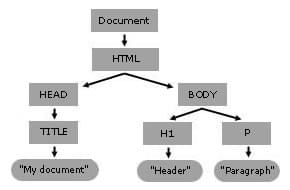

## LESSON 19:

- In web development, two types of scripting exist: server side and client side. Popular server-side scripting languages include: Perl, PHP, Python and Ruby. The book focuses on JavaScript for client-side scripting.

- Browser always accesses JS code through the use of `<script></script>` tag pairs regardless where the JS code lives. You can place the JS code in:
  - Its own external file with a .js extension
  - Directly in your HTML files:
    - In the `<body>` of the page
    - In the `<head>` of the page
    - Within an HTML tag, also known as Event Handler

- When you store your JavaScript in external files, place a link to that file in the `<head>` of the page and reference it in this manner:

```html
<script src="/path/to/script.js"></script>
```

- You can also enclose the code itself in the `<script></script>` tag pairs and place it in the `<head>` of the page and then refer to it (for example, by calling a function) later anywhere in the `<body>` of the page.

- See examples js-print-text.html and js-random-quote.html.

> Note, above examples are obtrusive JavaScript places behavior and interactivity within the HTML document itself.

### The Document Object Model (DOM)

- What you type into your text editor is marked up content. The markup uses a markup language like *Hypertext Markup Language* (HTML) or *Extensible Markup Language* (XML). When this is served to a browser, it is parsed. This parsing converts the marked up content to an internal, tree structured, object graph, called a `Document`. The browser provides a collection of standardized methods and properties through which this object graph can be read or manipulated called the Document Object Model (DOM) Application Programming Interface (API).

- Because the DOM API is the only collection of methods and properties natively available to scripting languages such as JavaScript in browsers for manipulating the object graph, the distinction between this collection and the internal object graph that it accesses is normally not relevant, so the term "DOM" is often used as if it were the object graph itself.

- The DOM represents a `Document` with a hierarchical tree of nodes. 

```html
<html>
  <head>
    <title>My Document</title>
  </head>
  <body>
    <h1>Header</h1>
    <p>Paragraph</p>
  </body>
</html>
```

  
*(DOM tree of the HTML code above)*

- Nodes may be strictly organizational, providing a means for grouping other nodes together or for providing a point at which a hierarchy can be constructed; other nodes may represent visible components of a document where each node represents a single object within the document (such as an element or text node).

> Note: Because the vast majority of code that uses the DOM revolves around manipulating HTML documents, it's common to refer to the nodes in the DOM as elements, although strictly speaking not every node is an element.

- The DOM represents the page so that programs can interact and change the document structure, style, and content. Without DOM scripting languages (such as JavaScript) wouldn't have any model or notion of web pages, HTML documents, SVG documents, and their component parts. The document as a whole and everything it contains are parts of the DOM for that document.

- As mentioned above, the DOM API is built using multiple APIs (standardized methods and properties) that work together. The DOM Core represents the functionality used for XML documents, and also serves as the basis for HTML DOM API. From there, it is expanded by other APIs as needed, such as, the SVG API for representing SVG documents to the DOM Core. The DOM defines the interfaces that describes documents and objects. These interfaces are a means of specifying a way to access and manipulate an application's internal representation of a document. 

- The `Document` interface represents any web page loaded in the browser and serves as an entry point into the web page's content, which is the DOM tree. However, there are other interfaces defined in the DOM specification, such as, `Window` and `Node`.

- The DOM API is used to build websites. The DOM was designed to be independent of any particular programming language, making the structural representation of the document available from a single, consistent API. Even if most web developers will only use the DOM through JavaScript, implementations of the DOM can be built for any language, such as Python.

- In very simple and incomplete terms the DOM is like the overarching framework. The overall container object is called the `document`. Any element that you create within the `document` to which you’ve given an `id` can be referenced by that `id`. For example, if you have a `<div>` with the `id` `wrapper`, then in the DOM that element is referenced as:

```js
document.wrapper
```

- If you wanted to change the style of the element you would change the style object associated with it, for example:

```js
document.wrapper.style.background-color="#ffffff"
```

### Rules to unobtrusive JavaScript

- It should be usable - without being noticed
- It should be easily degradable - no error messages, silently disappear
- Make it accessible - core site functions shouldn't rely on JS
- Keep it in separate files from structure and style  

See the unobtrusive version of js-random-quote.html here js-unobtrusive-random-quote.html. Some of the changes include:
- including a fallback text
- use of ids
- updating the DOM by using the `innerHTML` method
- moving the script just before the closing `</body>` tag, but ideally it should live in an external file

### Changing Images Based on User Interaction

- The book doesn't provide a complete code listing for this example, but I decided to take a couple of days to create, from scratch, a mini website like in the book to the best of my ability. See js-img-gallery.html.

- Overall it worked out great. I used both Grid and Flexbox extensively for the layouts. HTML was quite simple with the only exception being the JS event handlers embedded in the HTML that I borrowed from the book. The external JS file is solely for the chaning of the text that accompanies each picture with code partially lifted from previous projects in the book and some stackoverflow.

- Overall good example and can use it as basis for next projects. This was really my first "large" project I did completely from scratch.

---

**Links in the book:**

Official DOM specification: http://www.w3.org/DOM/  
Some JS library for image galleries: http://lokeshdhakar.com/projects/lightbox/  

## LESSON 20

Getting started with JavaScript Programming

### Basic concepts and terms:

- A **statement** is a section of code that performs a single action. A statement is typically a single line of JavaScript, though you can also break a statement across multiple lines or include more than one statement in a single line.

- A semicolon (`;`) marks the end of a statement, but you can also omit the semicolon if you start a new line after the statement. So you can separate statements by either using a semicolon or a new line or both.

- Below are four valid statements. Because they are each on a new line, the semicolon is optional, though if you were to but all on the same line, you would have to use semicolon.

```js
now = new Date();
hours = now.getHours();
mins = now.getMinutes();
secs = now.getSeconds();
```

- A **function** is a number of JavaScript statements that are treated as a single unit. A statement that uses a function is referred to as a function call. A function can accept a parameter and also return a value. A parameter is an expression inside the parentheses that tells the function what to do. A function can also return a value to a waiting variable.

- For example, the following function call prompts the user for a response and stores it in the text variable:

```js
text = prompt("Enter some text.")
```

- A **variable** is a container that can store a number, a text string, an object or another value. For example:

```js
var fred = 27;
```

> Note, use single equality operator (`=`) for assignments. Use double or triple equality opeartor for comparisons (`==` or `===`), like for example, in a conditional statement.
>
> When choosing between a double or tripe equality operator for comparisons, the best practice suggests it's always better to use the triple equality operator.

- An **object** is a collection of related data and/or functionality. Where a variable stores a single piece of information (a single entity), an object can store two or more pieces of data at once. Objects usually consist of several variables (which inside an object are called *properties*) and functions (inside an object called *methods*). Objects encapsulate these related variables and functions into efficient packages and act as handy data containers. Note that even though an object can consist of several variables, you can also assign an object to a variable.

- *Properties* are the variables that store the objects data. And just like variables, each property has a value. For example, an object might represent an individual person with properties like name, address and telephone number providing the information about this person. To read a property's value, you simply reference the object name and property name, separated by a period. For example, `Bob.address` or `Bob.phone`. You can change a property's value by using the `=` operator, just as you can change the assignment of a value to a variable.

- *Methods* are functions that work with an object's data and each object can have one or more methods. Like other functions, methods can accept arguments in parentheses, and they can return values. For example, our person object might include a `display()` method to display the person's information. In JavaScript terminology, the statement `Bob.display()` would display Bob’s details.

- JavaScript supports three kinds of objects:
  - Built-in objects like `Date`, `Array`, `String`, `Math`, `Boolean`, `Number`, and `RegExp`.
  - DOM objects. For example `alert()` function is a method of `window` object.
  - Customer objects that you build yourself, like the person object discussed above.

- A **conditional statement** checks for certain conditions when the script runs. For example, an `if` statement.

- A **loop** is a group of statements that repeat a certain number of times. For example, the `for` statement is one of several stements used for loops. 

- An **event handler** is a script that tells the browser what to do when a certain event occurs. For example, events such as when the mouse button is pressed or when a page is finished loading. You specify the event handler as an attribute within the HTML tag and include the JavaScript statement to handle the event within the quotation marks. You can define your own functions to act as event handlers, for example: 

```js

```

> Note, Using an attribute on the HTML tag is not unobtrusive. You’ll learn how to make event handlers unobtrusively in later lessons.

### Order of script execution

Any number `<script>` tag pairs, external JavaScript files and event handlers can be used within a single document. Below describes scripts in which areas of the document execute first. If there are multiple scrits specified within the same area, they are evaluated in the order that they are written in.

1. Sets of `<script>` tags within the `<head>`.
2. Sets of `<script>` tags within the `<body>` while the page loads and displays.
3. Event handlers are executed when their events occur.

> It’s important to know that every time the browser encounters a `<script>` tag, it stops concurrent downloading to download and parse just that script. All other HTML tags and elements are threaded, which means browsers can download several at a time. This is why it’s important to have as few `<script>` tags in your document as possible, and, whenever possible, to load them last in the HTML.

- Remember than JavaScript is case sensitive. The basic rules are:
  - Keywords such as `for` and `if` are alaways lower case.
  - Built-in objects such as `Math` and `Date` are always capitalized.
  - DOM object names such as `setAttribute` and `getElementById` use "lower camel case" naming convention where you stick together multiple words, using lower case for the whole first word and then capitalize subsequent words.

- Variable, object and function names can include uppercase and lowercase letters, numbers and the underscore ( `_` ). They must begin with a letter or an underscore though. The names also must not be reserver keywords. See a full list of reserved keywords on MDN.

- JavaScript ignores whitespace. Use it as liberally as you wish.

- Two types of comments:

```js
// single line comment

/*
multi-line
comment
*/
```

- Two key points and reminders:
  - User external JavaScript files whenever possible, and as few as possible. This way the page loads faster and encourages the writing of modular scripts that can be reused.
  - Use a semicolon at the end of each statement and use only one statement per line. This improves readability and makes it easier to debug.

### Using JSON

- JSON-encoded data is expressed as a sequence of `parameter` and `value` pairs, with a colon separating each parameter and its value. These `"parameter":"value"` pairs are separated by commas. The whole sequence is enclosed in curly braces to form a JSON object.

- For example, the following creates a variable that stores a JSON object called `yourObject`:

```js
var yourObject = {
   "param1":"value1",
   "param2":"value2",
   "param3":"value3"
};
```

- JSON objects can have properties and methods accessed directly using the usual dot notation:

```js
alert(yourJSONObject.param1); // alerts 'value1'
```

- It is easy to convert a JSON object into a string through a process known as serialization; serialized data is convenient for storage or transmission around networks. JSON is used a lot in APIs.

---

**Links in the book:**

List of reserved keywords: https://developer.mozilla.org/en-US/docs/Web/JavaScript/Reference/Lexical_grammar#Keywords  
JSON docs: http://www.json.org/  

## LESSON 21

### Understanding DOM

- JavaScript can change and manipulate documents in the browser even after the page has loaded. It can add or remove elements, change text and much more - all dynamically without requiring additional requests to a server.

- To work with the browser and documents, JavaScript uses the hierarchy of parent and child objects found within the DOM that represent all the content and components of a web document and the browser that renders it. When you refer to a DOM object, you use the parent object name followed by the child object name or names, separated by periods.

```js
window.document.getElementById("someElement")
```

> Note that in the book they refer to DOM interfaces as objects.

- The `window` object represents the browser window and is the parent object for other objects like `document`, `location`, `history` etc. Even though `window` is the parent object, in most situations you can omit it, for example: 

```js
document.getElementById("someElement")
```

### Working with the `document` object - getting information about a Document

- Some of the properties of the `document` object:
  - `document.URL` - returns document's URL; cannot be changed
  - `document.title` - returns the value of `<title>` tag; can be changed
  - `document.referrer` - returns the URL of the page the user was viewing before the current page - usually the page with a link to the curret page; cannot be changed
  - `document.lastModified` - returns the date the document was last modified
  - `document.cookie` - enables you to read or set a cookie used within the document
  - `document.images` - returns a collection of images used in the document

### Writing text in a Document

- `document.write()` method can write text as part of the HTML in a document

### Working with `link` and `anchor` object

- A document can contain, and very likley does, multiple links. A `link` object is a child of the `document` object and has a list of properties with the `href` property containing the entire URL, and other properties define other, smaller, portions of it.

- A `links` array contains all `link` objects in the current page. A property of the array, `document.links.length`, indicates the number of `link` ojects (and thus links) in the page.

For example, the following statement assigns the entire URL of the first link stored in the array to the variable `link1`:

```js
var link1 = links[0].href; //omits the document.
//below is just an illustration of points above
document.link
document.links
document.links.length
document.links[0].href
```

- Similarly, there's an `anchor` object, an `anchors` array and a `document.anchors.length` property. For example, you could use `anchors` array to loop through all the anchors on a given page to dynamically generate a table of contents at the top of the page.

### Working with the `history` object

- The `history` object is another child property of the `window` object. The object holds information about the locations (URLs) that have been visited before and after the current one, and it includes methods to go to previous or next locations.

- The `history` object has one property `history.length` which returns the number of different locations the user has visited.

- The `history` object has three methods you can use to move through the history list:
  - `history.go` - accepts positive and negative integers to open a specific URL from the history list. For example `history.go(-2)` is the same as clicking the back button twice.
  - `history.back` - loads the preceding URL in the history list (one step back)
  - `history.forward` - loads the next URL in the history list (one step forward)

- For an example on how to create your own navigation back and forth buttons see l21-back-forth-buttons.html

### Working with the `location` object

- The `location` object is another child property of the `window` object. The object holds information about the URL currently loaded in the browser window. You can also load a URL into the current window by assigning a value to the `href` property:

```js
window.location.href="http://www.google.com";
```

- The `location` object has the same set of properties as the `link` object. The following is the list of properties (prefix them with `location.` or `link.` as needed): `protocol`, `hostname`, `port`, `pathname`, `search`, `host` and `hash`.

> Although the `location.href` property usually contains the same URL as the `document.URL` property described earlier in this lesson. But you can’t change the `document.URL` property. Always use `location.href` to load a new page in a given window.

- The `location` object also has three methods:
  - `location.assign` - loads a new document e.g. `location.assign("https://www.google.com")`
  - `location.reload` - same as the refresh button in the browser
  - `location.replace` - replaces the current location with a new one, but unlike the properties above you cannot use the back button (good for temporary pages etc.).

### More about the DOM structure

- Reiterates on the DOM tree: the DOM adds objects under the document object for every element of a page. In the DOM, each container within the page and its contents are represented by an object. The objects are organized into a treelike structure, with the document object itself at the root of the tree and with individual elements such as the heading and paragraph of text at the leaves of the tree.

- Each container or element in a document is called a node in the DOM. You can refer to nodes by assigning an ID or by navigating the tree using the relationships between the nodes.

- The element and the text the element contains are treated as two separate nodes. The formed being refered to as node and the latter as text node. For example, the actual text in the paragraph is a node in itself and is a child of the `p` object rather than being a grandchild of the `body` object. Similarly, the text within the `<h1>` tags is a child of the `h1` object.

- The DOM uses another term for organization of objects: siblings. This refers to objects that have the same parent - in other words, objects at the same level in the DOM object tree.

### Working with DOM nodes

- Each node (object) in the DOM tree can be accessed in JavaScript. Basic node properties:
  - `nodeName` - The name of the node (not the ID). For nodes based on HTML tags, such as `<p>` or `<body>`, the name is the tag name: `p` or `body`. For the document node, the name is a special code: `#document`. Similarly, text nodes have the name `#text`. This is a read-only value.
  - `nodeType` - An integer describing the node’s type, such as `1` for normal HTML tags, `3` for text nodes, and `9` for the document node. This is a read-only value.
  - `nodeValue` - The actual text contained within a text node. This property returns `null` for other types of nodes.
  - `innerHTML` - The HTML content of any node. You can assign a value including HTML tags to this property and change the DOM child objects for a node dynamically.

> The `innerHTML` property is often the easiest way to change content in a page. The `innerHTML` property is not officially part of the standard but is supported by all major browsers and is safe to use. You can also accomplish this in a more standard way by deleting and creating nodes described below.

- Node relationship properties (as described in the DOM structure section above):
  - `firstChild` - The first child object for a node. For nodes that contain text, such as `h1` or `p`, the text node containing the actual text is the first child.
  - `lastChild` - The node’s last child object.
  - `childNodes` - An array that includes all of a node’s child nodes. You can use a loop with this array to work with all the nodes under a given node.
  - `previousSibling` - The sibling (node at the same level) previous to the current node.
  - `nextSibling` - The sibling after the current node.

### Document methods

- The `document` node itself has several very useful methods:
  - `getElementById(id)` - Returns the element with the specified `id` attribute.
  - `getElementsByTagName(tag)` - Returns an array of all the elements with a specified tag name. You can use the wildcard `*` to return an array containing all the nodes in the document.
  - `createTextNode(text)` - Creates a new text node containing the specified text, which you can then add to the document.
  - `createElement(tag)` - Creates a new HTML element for the specified tag. As with `createTextNode`, you need to add the element to the document after creating it. You can assign content within the element by changing its child objects or the `innerHTML` property.

### Node methods

- Each node within a page has a number of methods available. Which of them are valid depends on the node’s position in the page and whether it has parent or child nodes:
  - `appendChild(new)` - Appends the specified new node after all the object’s existing nodes.
  - `insertBefore(new, old)` - Inserts the specified new child node before the specified old child node, which must already exist.
  - `replaceChild(new, old)` - Replaces the specified old child node with a new node.
  - `removeChild(node)` - Removes a child node from the object’s set of children.
  - `hasChildNodes` - Returns the Boolean value `true` if the object has one or more child nodes or `false` if it has none.
  - `cloneNode` - Creates a copy of an existing node. If a parameter of `true` is supplied, the copy will also include any child nodes of the original node.

### Controlling positioning, visibility and text with JavaScript

- After learning about the structure of the DOM in sections above, you can start thinking about how you can control any element in a web page. You can group elements in a container elements and move all of the child objects by controlling just the container.
  - See an example of moving a object around the page using JavaScript and showing and hiding it l21-movable-layers.html

- An alternative to using `display: none` and `display: block` is to use the `visibility` property that every object has with possible values `"visible"` or `"hidden"`.
  - See an example of using `visibility` property in l21-hiding-showing.html.

- Modify the contents of any element using the `nodeValue` property. The `nodeValue` property of a text node contains its actual text, and the text node is the child of the element (node).
  - See an example of using the `nodeValue` property in l21-modify-text.html.

- To add new text to a page (instead of modifying existing text) you must first create a new text node using the `createTextNode()` method. Then you need to add the new text node to the document using the `appendChild` method.
  - See an example of using the above methods in l21-add-text.html.

- Bonus: did a bonus exercise see l21-bonus-hiding-showing.html.

---

**Links in the book:**

A complete list of all available properties and methods: http://www.w3.org/TR/DOM-Level-3-Core/  

## LESSON 22

- Key concepts in this lesson: variables, strings, arrays, functions (group code) and objects (group data)

### Using variables with `let` and constants with `const` (from MDN)

> Note that this book is using `var` for variable definitions. This is outdated and you should always use `let` or `const` instead of `var`. The `let` and `const` declarations also fix a number of issues that are present when using the `var` declaration.

- Declare variables using `let` like this:

```js
let myName;
let myAge;
```

- If you try to return them they will return a value of `undefined`. Don't confuse a variable that exists but has no defined value with a variable that doesn't exist at all - they are very different things. Returning a variable that doesn't exist will produce an error.

- Once you declare a variable, you can initialize it with a value. For example:

```js
myName = "Chris";
myAge = 37;
```

- As a shorthand, you can declare and initialize a variable at the same time. For example:

```js
let myName = "Chris";
let myAge = 37;
```

- If you want to update a variable (change the value it stores) you would use the same syntax as initializing a variable. For example:

```js
myName = "Tom";
myAge = 28;
```

> Note, you only use the `let` declaration once - when declaring a new variable for the first time. You don't use it when you want to initialize it with a value or update the value the variable stores (for example, when incrementing or decrementing it), attempting to redeclare the same variable will return an error.

- However, when you use `var` you can declare and initilize a variable and declare it again afterwards and it will still work. You can also redeclare variables using `var`. These and more confusing and inconsistent behaviours are fixed when using `let` to create a more consistent and predictable outcome. That's why you should always use `let` instead of `var`.

- In JavaScript you can also declare constants using `const`. Constants are like variables, except that:
  - You must initialize them at the same time as you declare them
  - You cannot update them (assign a new value) after you've initialized them

- Even though you cannot update constants, you can update the content of the value that the constant stores. For example, if you assign an object to a constant you can update, add, or remove properties of that object, because even though the content of the object has changed, the constant is still pointing to the same object. For example:

```js
const bird = { species : 'Kestrel'};
console.log(bird.species);  // "Kestrel"

bird.species = 'Striated Caracara';
console.log(bird.species);  // "Striated Caracara"
```

- Using constants is very useful because it tells anyone looking at your code that this name will never be assigned to a different value. Any time they see this name, they will know what it refers to. Therefore you should always use `const`, and only use `let` when you have to.

- Because JavaScript is a "dynamically typed language", which means that, unlike some other languages, you don't need to specify what data type a variable will contain, you can use the special operator `typeof` to return the data type of the variable. For example:

```js
typeof myName
```

- The differences between `var`, `let` and `const` make it so you always want to explicitly write your declarations using either `let` or `const` because if you omit them and declare and initialize using, for example, only `myName = "Chris";` it will default to functioning as `var`, which you don't want.

### Using variables with `var` (from book)

- Choosing a variable name:
  - Variable names can include both upper- and lowercase letters, digits (0-9) and an underscore ( _ )
  - The first character must be either a letter or an underscore (though it's recommended to not use an underscore as the first character)
  - And like everything in JavaScript variable names are case sensitive

- A variable’s scope is the area of the script in which that variable can be used. There are two types of variables:
  - **Global variables** have the entire script (and other scripts in the same HTML document) as their scope. They can be used anywhere, even within functions. To create a global variable you declare it in the main script outside of any functions. Using the `var` keyword when declaring global variables is optional, however, it's considered best practice to do it anyway to improve readability.
  - **Local variables** have a single function as their scope. They can be used only within the function they are created in. In addition, the variables in the function’s parameter list are always local variables. Using the `var` keyword when declaring local variables is mandatory. This forces JavaScript to create a local variable, even if there is a global variable with the same name, however, it's best practice to keep variable names distinct, even if you are using them in different scopes.  
  *(note that some of the above is obsolete due to `let` and `const`)*

- Use a single euqal sign (`=`) to assign a value to a variable.
  - For example `var a = 40`.
  - You can use any expression to the right of the equal sign, including other variables. For example to increment a variable by `1` you use `a = a + 1`.
  - A shorthand for incrementing and decrementing variables are `+=` and `-=` operators. For example `a += 1` and `a -= 1`. Note that you can also use the `+=` shorthand to concatenante text to a string, for example, this statement adds a period to the current contents of a string variable named `sentence` like `sentence += ".";`.
  - An even shorter way is to use the increment and decrement operators `++` and `--` which inrement and decrement by 1 by default. For example `a++` increments variable `a` by 1 and `a--` decrements variable `a` by 1.
  - You can also use the increment and decrement operators before the variable name, for example: `++a` and `--a`. However:
    - If the operator is after the variable name (`a++`), the increment or decrement happens after the current expression is evaluated. For example, `alert(a++)` will display an alert with value `40` and only then increment `a` to `41`.
    - If the operator is before the variable name (`++a`), the increment or decrement happens before the current expression is evaluated. For example, `alert(++a)` will first increment `a` to `41` and only then display an alert with value `41`.

> Note that ultimately it doesn't matter if you use the longhand or shorthand syntax, either way the value returned is the same. It's just there for convenience.

- The most popular (note this is not an exhaustive list) operators in JavaScript are: 
  - A `+` sign for string concatenation and numeric additon.
  - The usual arithmetic operators `-`, `*`, `/`, `%` (modulo), `++` (increment) and `--` (decrement).

- JavaScript uses the usual mathematical operator precedence to evaluate expressions. Meaning, parentheses are evaluated first, followed by multiplication and division, followed by addition and subtraction.

### Data Types in JavaScript

- JavaScript is a "dynamically typed language" so you don't need to specify the type of data a variable will store. 

- The basic JavaScript data types are:
  - Number - Both integers (e.g. `25`) and floating-point numbers (e.g. `1.4142138`).
  - Boolean - Either `true` or `false`.
  - String - Strings are actually `String` objects (e.g. `"Have a nice day"`)
  - Null - The null value, represented by the keyword `null`.

- You can change the value a variable holds and the values don't need to be the same data type. For example you can define a variable `var total = 31;` and then change it to `total = "albatross";`.

- JavaScript handles conversions between data types for you automatically whenever it can. For example if a variable `total` contains a numeric values of `40`, then `document.write("The total is " + total);` would return `"The total is 40"`. 

- In situations where you end up with a string containing a number and need to convert it to a regular numeric value you can use functions below. Both functions ignore the nonnumeric portion of the string, for example `var stringvar = "30 angry polar bears";` parsed like `var numvar = parseInt(stringvar);` would store only the number `30`.
  - `parseInt` - converts a string to an integer number
  - `parseFloat` - converts a string to a floating-point number

> Note, if a valid number is not found, the function returns the special value `NaN`, meaning not a number.

### Working with `String` objects

- JavaScript stores strings as `String` objects. There are common string manipulation techniques that use methods (built-in functions) of the `String` object.

- There are two ways you can create a `String` object and there is no difference in the strings created by the two methods. The former uses a variable and the latter uses a object-oriented syntax:
  - `var a = "this is a string";` (recommended, just use `let` instead)
  - `a = new String("this is a string");`

*(Note there's a small error in the book where it states "the following statement replaces the contents of the `stringtest` variable with a new string". It doesn't actually update the `stringtest` variable, it redeclares it because of the presence of `var`. This is why you should use `let` instead as this kind of behaviour is not allowed and would rightfully return an error.)*

- To find how many characters a string variable contains use the `length` property of the `String` object. For example, below will return integer value `15` which can be used in any numeric expression.

```js
var stringtest = "This is a test.";
console.log(stringtest.length);
```

- To convert the contents of a string to all uppercase or all lowercase use `toUpperCase` and `toLowerCase` methods. For example: 

```js
document.write(stringtest.toLowerCase());

//or if you want to change the stored string value itself
stringtest = stringtest.toLowerCase();
```

> Note that methods always use parentheses, even when there are no parameters. Properties don't.

- Understanding index parameters:
  - Index always starts with `0`. For example, 4th character will have an index of `3`.
  - The first index value is inclusive and the second is noninclusive. For example, a second index of `6` includes up to index `5` (the sixth character).
  - You can specify the two indexes in either order. The smaller one will be assumed to be the first index.

- The `substring()` method returns a portion of the original string between two index values, which you must specify in parentheses. For example:

```js
var alpha = "ABCDEFGHIJKLMNOPQRSTUVWXYZ";
alpha.substring(0,4) //returns ABCD.
alpha.substring(10,12) //returns KL.
alpha.substring(6,7) //returns G; 6 inclusive 7 exclusive leaves only 6.
alpha.substring(6,6) //returns the null value; 6 inclusive 6 exclusive leaves nothing.
alpha.substring(6,5) //returns F; 5 is assumed to be the first index (inclusive) 6 exclusive.
```

- The `charAt()` method returns a single character from a specified index position within a string. For example:

```js
alpha.charAt(0) //returns A.
alpha.charAt(12) //returns M.
```

- To find a substring use the `indexOf` method to search for the substring beginning from left to right or the `lastIndexOf` method to search for the substring beginning from right to left. Both methods will return the **starting** (leftmost) index position of the substring. 

- Both methods accept one or two parameters. The first parameter specifies the substring you're searching for. The second parameter (inclusive) optionally specifies the starting position from which you want the search to start. Note that for `indexOf` the default starting positon is `0` but for `lastIndexOf` the default starting position is the max index value (which in below example is `10`). For example:

```js
var nums = "10100111001" //this is a string; 11 characters in total, last index of 10 
console.log(nums.indexOf("1")) //returns 0
console.log(nums.indexOf("1",1)) //returns 2
console.log(nums.lastIndexOf("1")) //returns 10
console.log(nums.lastIndexOf("1",9)) //returns 7
console.log(nums.lastIndexOf("11",9)) //returns 6
```

### Working with Arrays

- An array is a numbered group of data items that you can treat as a single unit. Arrays can contain strings, numbers, objects, or any other types of data. Each item in an array is called an element. 

> Note, that arrays are just variables and you should use `let` or `const` in array declarations. The book it outdated in this aspec and doesn't explicity mention this.

You can create a numeric array in three different ways:
- (Option 1) You can create an empty array or an array of a specific length. When you create an empty array the `length` property will return `0`. If you create an array of a specific length (a single number specifying the number of elements), then the `length` property will return the number of elements the array constains. Thus, you can create, for example, an array named `scores` in the following ways:

```js
scores = new Array(); //empty array; console.log(scores.length) returns 0
scores = new Array(4); //array with 4 elements; console.log(scores.length) returns 4
```

- Then, regardless with it's an empty array or an array of specific length, you assign values to the elements (if elements don't exist, like in an empty array, the elements will be created) in the array using indexes, for example:  

```js
scores[0] = 39;
scores[1] = 40;
scores[2] = 100;
scores[3] = 49;
```

- (Option 2) You can also declare an array and specify values for elements at the same time. Notice that if you use a single number in the parentheses (like in option 1) it defines the array length, if you use two or more numbers, it creates elements and assigns those numbers as element values. For example: `scores = new Array(39,40,100,49);`. Has a `console.log(scores.length)` of `4`.

- (Option 3) You can also use a shorthand syntax to declare an array and specify its contents like `scores = [39,40,100,49];`.

> Note when to use parentheses `( )` and when to use brackets `[ ]`.

- It doesn’t matter which of the above methods you use, all create equivalent arrays. The last method is the simplest and has the most distinct syntax though. 

- You don't have to assign values or create array elements in a consecutive order. The below example creates an empty array and then creates and assigns values to elements 1 and 6 (index `0` and `5`). The `console.log(test.length)` returns `6`, and if you try to return a value from, for example, element 3 using `console.log(test[2])` it will return `undefined`.

```js
test = new Array();
test[0] = 21;
test[5] = 22;
```

- All the methods discussed so far for creating numeric arrays work also with string arrays. In fact, JavaScript doesn't make a distinction between the two. Also, you can use string array elements anywhere you would use a string. You can even apply string methods to array elements, for example:

```js
names = ["John H. Watson", "Sherlock Holmes"]; //creates a string array with 2 elements
console.log(names[0].substring(0,4)); //returns John
```

- Two string manipulation methods `split()` and `join()` are useful for splitting a string into individual parts or combining multiple strings into one (both methods use a delimiter). For example:

```js
//string split
const name = "John Q. Public"; //create a constant that stores a string
parts = name.split(" "); //split using space and store in a string array named parts
console.log(parts[0]); //first element returns John
console.log(parts[1]); //second element returns Q.
console.log(parts[2]); //third element returns Public

//string join
const fullname = parts.join(" "); //concatenates array elements into a const named fullname
console.log(fullname) //returns John Q. Public
```

- Use the `sort()` method for string arrays to return an alphabetically sorted (ascending) version of the array. For example:

```js
names = ["ZZ", "AA", "DD", "CC"]; //create a string array with 4 elements
names.sort(); //sort the array in alphabetical order
console.log(names); //returns the array in a new sorted order 
```

- Whenever the `sort()` method is invoked to sort an array, it sorts the elements of the array *in place*, meaning the output of the method automatically overwrites the input (the contents of the array itself). This means that the old order of the array is no longer be available. Consider the example below:

```js
const test = ["ZZ", "AA", "DD", "CC"]; //create a constant string array
console.log(test); //returns the array ["ZZ", "AA", "DD", "CC"]
const test2 = test.sort(); //overwrites the test array in a sorted order, also assigns it to a new constant test2 
console.log(test); //returns ['AA', 'CC', 'DD', 'ZZ']
console.log(test2); //returns ['AA', 'CC', 'DD', 'ZZ']
```

- The `sort()` method is built upon converting the elements into strings before performing the comparison. Numeric and time sorts therefore are not reliable unless you specify an optional `compareFunction()` within the `sort()` method. The compare function must specify the first element of comparison `a` and the second element of comparison `b`. If you omit the `compareFunction()` then the `sort()` method will default to comparing strings. The syntax of the compare function for numeric values is:

```js
function functionName(a, b) {
  return a - b; //ascending order; b - a would be descending
}
```

> When sorting in ascending order `a - b`, if comparison returns a negative number then `a` belongs before `b`, if it returns 0 then keep original order and if it returns a positive number then `a` belongs after `b`.

- See below example on how to sort a numeric array. Note that instead of defining the `compareFunction()` and then passing it as a parameter to the `sort()` method like below, you can also just define it inline directly within the `sort()` method.

```js
const numbers = [4, 2, 5, 1, 3]; //define a constant numeric array
function compareFunction (a, b) { //define a compareFunction
  return a - b;
};
numbers.sort(compareFunction); //sort the numbers array by passing the compareFunction
console.log(numbers); //returns the same numbers array but now sorted [1, 2, 3, 4, 5]
```

- For a nice example regarding string arrays and displaying a sorted result see l22-sort.html and l22-sort.js. 

### Using functions to organize your scripts

- A function is a group of JavaScript statements that can be treated as a single unit. The most basic syntax for defining a function is:

```js
function functionName() {
  //statements go here
};
```

- The curly braces `{ }` enclose all statements within the function and allows browser to determine where the function starts and ends. 

- For the statements within the function to execute you must call the function first. Notice in the below example how the statements that are not contained within a function execute automatically when page is loaded, but do not when they are inside a function.

```js
//alert is executed automatically when page loads
<script>
    alert("Greetings!");
</script>

//alert is not executed automatically when page loads; function must be called first
<script>
  function Greet() {
    alert("Greetings!");
  };
</script>
```

- Notice that the parentheses `( )` in the above example are empty. To make a function more dynamic you can add parameters. Parameters are variables that are assigned values passed to the function each time it is called.

- You define parameters when you define the function. Below example defines a parameter named `who` for the `Greet` function:

```js
function Greet(who) {
  alert("Greetings, " + who + "!");
}
```

- To call a function, use the function's name as a statement in a script or as an action associated with an event. Within parentheses include the values for the function's parameters, if any. For example, in order to call the above function you you simply need to execute the below statement:

```js
Greet("Matiss");
```

- The value `"Matiss"` gets passed to the function which is then assigned to the `who` variable. You can define and call multi-parameter functions separating the variables in the definition and the values using comma (`,`).

- To see an example of defining and calling a function with a parameter see l22-function.html.

- The functions in above examples displayed an alert pop-up, however, a function can also return a value. To send the result back to the script that called the function, you include the `return` keyword as part of the function definition. See an example of the use of the `return` keyword in l22-return.html.

### Creating and using Objects

- See [LESSON 20](#lesson-20) for a basic definition and an introduction to Objects in JavaScript.

- The below exercises focus on creating `Card` objects that contain information about a person. Each person is represented by a new `Card` object which contains properties for name, address and phone number.

- STEP 1: The first step to creating an object is to define the object and its properties. In order to do this you need to define a function that creates a new instace of the `Card` object. This function is called the *constructor*. For example:

```js
function Card(name,email,address,phone) {
  this.name = name;
  this.email = email;
  this.address = address;
  this.phone = phone;
}
```

- The constructor is a simple function that accepts parameters to initialize a new object and assigns them to the corresponding properties. This means that all `Card` objects will have the same properties. Think of it like setting up a template. 

> Note the use of `this` keyword in the object definition and later in the method definition. The `this` keyword refers to the current object - the one that's being created.

- STEP 2: After you've defined the constructor function that will create the `Card` objects and their properties, you can define a function that the object can use as a method. Below is an example of a function that reads the properties from the current object (`this`), prints each one with a label string before it, and then creates a new line.

```js
function printCard() {
  let name_line = "Name: " + this.name + "<br>\n";
  let email_line = "Email: " + this.email + "<br>\n";
  let address_line = "Address: " + this.address + "<br>\n";
  let phone_line = "Phone: " + this.phone + "<hr>\n";
  document.write(name_line, email_line, address_line, phone_line);
}
```

- STEP 3: Now that you have a function that prints a card, you need to make the `printCard` function part of the function definition for `Card` objects for it to become a method of the `Card` object. Below is the amended version of the constructor function from STEP 1:

```js
function Card(name,email,address,phone) {
   this.name = name;
   this.email = email;
   this.address = address;
   this.phone = phone;
   this.printCard = printCard;
}
```

> Note, consider using lowercase names like `address` for properties and lower camel case names like `printCard` for methods as a way to distinguish and make it clear which one is a property and which is a method.

- After you've created an object definition (step 1), a method (step 2) and included the method to be part of the object definition (step 3) you can start creating new `Card` objects using the `new` keyword. For example, the below statement creates a new `Card` object named `tom`:

```js
//option 1
tom = new Card("Tom Jones", "tom@jones.com", "123 Elm Street, Sometown ST 77777", "555-555-9876");
```

- You must enter the required parameters in the same order that they appear in the object definition. The new object named `tom` is called an instance of the `Card` object. Just as there can be several variables or arrays, there can be several instances of an object you define. 

- Alternatively, you can create an empty `Card` object and then assign its properties:

```js
//option 2
holmes = new Card();
holmes.name = "Sherlock Holmes";
holmes.email = "sherlock@holmes.com";
holmes.address = "221B Baker Street";
holmes.phone = "555-555-3456";
```

- After you've create an instance of the `Card` object using either of the two options above, you can use the `printCard` method to display its information, for example:

```js
tom.printCard();
```

- For an example see l22-card-object.html.

> Note: many objects in JavaScript, such as DOM objects, include parent and child objects (objects nested within objects). You can also create these nested structures and include child objects in your custom object definitions. In order to do that, just create a constructor function for the child object and then add a property to the parent object definition that corresponds to it.  
> For example, if you created a `Nicknames` object to store nicknames for individuals, you could add it as a child object in the `Card` object's constructor like `this.nick = new Nicknames();`.

> Note 2: since an object can be assgined to an array and arrays can contain multiple array elements, it means that you can also create an array of custom objects. You would need to create the object definition as usual as well as define an array. Then assign a new object to each array element (for example, `cardarray[1] = new Card();`). You can even use a loop to assign objects to an entire array at once.

### Extending built-in Objects

- JavaScript includes the ability to extend built-in objects by adding new properties or methods. For example, you can extend the `String` object that manipulates strings in unique ways.

- To add new properties or methods use the `prototype` keyword which allows you to change the definition of an object outside its constructor function.

- For example, you can add a method to the `String` object definition named `heading` which converts a string into an HTML heading with a level (1-6) of your choosing. For an example see l22-extending-object.html.

### Using `Math` Object

- The `Math` object is a built-in JavaScript object with properties representing mathematicl constants and methods representing mathematical functions. You don't need to create a math object because it exists automatically in every program.

- Methods for rounding decimals take the number to be rounded as their only parameter:
  - `Math.ceil()` - rounds a number up to the next largest integer.
  - `Math.floor()` - returns the largest integer less than or equal to a given number.
  - `Math.round()` - returns the value of a number rounded to the nearest integer.

- To round a number to two decimal places (as for currency, for example) you can create a function that simulates this calculation. The function multiplies the `num` by `100` to move the decimal point two places to the right and rounds the value to the nearest integer. The value is then divided by `100` to restore the decimal point to its original position moving two places to the left.

```js
function round(num) {
   return Math.round(num * 100) / 100;
}
```

- The `Math.random()` method returns a floating-point, pseudo-random number in the range 0 to less than 1 (inclusive of 0, but not 1) with approximately uniform distribution over that range - which you can then scale to your desired range. For example, if you want a random number between 1 and a chosen max value (both inclusive), then you can use the function below:

```js
function rand(num) {
   return Math.floor(Math.random() * num) + 1;
}
```

- See l22-math-random.html that uses a `for` loop to test the mean of 5000 numbers generated by the `Math.random()` method.

### Using `Date` Object

- JavaScript built-in `Date` objects represent a single moment in time in a platform-independent format. Date objects contain a number that represents milliseconds since 1 January 1970 UTC. The `Date()` constructor is used to instantiate a `Date` object using the `new` keyword.

- There are many different syntaxes you can use to instantiate a `Date` object. Some examples are:

```js
let today = new Date()
let birthday = new Date(1995, 11, 17) //month is 0-indexed
let birthdaytime = new Date('1995-12-17T13:24:00') 
```

- When no parameters are provided, the newly-created `Date` object represents the current date and time as of the time of instantiation.

- Various `set` methods enable you to set components of a `Date` object to values: `setDate`, `setMonth`, `setFullYear`, `setTime`, `setHours`, `setMinutes` and `setSeconds`. For example, you can instantiate a `Date` object with no parameters to represent the current date and time and then change only the year component:

```js
let today = new Date();
today.setFullYear(1995);
```

- You can use the same methods you used for setting components to also read components from a `Date` object by simply replacing the `set` with `get` in the methods names.

- All of the `set` and `get` methods above also have equivalent UTC-based methods. Replace the `set` or `get` in the methods names with `setUTC` or `getUTC` respectively.

- To convert the `Date` object's time value to text using UTC use `toUTCString` or using local time use `toLocalString`.

- The method `getTimeZoneOffset` gives you the local time zone's offset from UTC.

- Finally, you can use a `Date.UTC()` method that is similar to `Date()` constructor only treats the parameters as UTC. For example, the following statement creates a `Date` object with the arguments treated as UTC instead of local:

```js
let utcDate = new Date(Date.UTC(2018, 11, 1, 0, 0, 0));
```

---

**Useful links:**

- String definition: https://developer.mozilla.org/en-US/docs/Web/JavaScript/Reference/Global_Objects/String#creating_strings  
- JavaScript escape sequences (e.g. "/n" newline character): https://developer.mozilla.org/en-US/docs/Web/JavaScript/Reference/Global_Objects/String#escape_sequences  
- The `sort()` method: https://developer.mozilla.org/en-US/docs/Web/JavaScript/Reference/Global_Objects/Array/sort  
- Full list of properties and methods available in `Math` object: https://developer.mozilla.org/en-US/docs/Web/JavaScript/Reference/Global_Objects/Math  
- Proposal Temporal (replacement of `Date`): https://tc39.es/proposal-temporal/docs/index.html  

## LESSON 23

- This lesson looks at two flow control concepts in JavaScript: 
  - **Conditionals** 
    - `if...esle` statement
    - comparison operators
    - logical operators 
    - ternary operator 
    - `switch` statement 
  - **Loops** 
    - `for` loops 
    - `while` loops 
    - `do...while` loops
    - infinite loops, `label`, `break` and `continue`
    - `for...in` loops
    - `for...of` loops

> Note, the book doesn't cover the `label` statement and the `for...of` loops (information taken from MDN links below). Otherwise the lesson is quite comprehensive.

- Note that braces (`{ }`) in JavaScript are used to group individual statements in a code block called a *block statement* (see MDN link below). Note that in certain circumstances, however, braces can have other meanings as well like object construction.

- Statements in JavaScript are executed in the order in which they appear, one after the other. Because this order isn't always practical, flow control statements let you control the order in which code is executed. A funcion could also be considered a flow control statement since you can define a function at the start of the program and execute it at any point down the line.

### Conditional and logical operators

- Either side of a conditional expression can be a variable, a constant, or an expression. For example, you can compare a variable and a value or compare two variables. Between the two values to be compared is a conditional operator:
  - `===` Strict equality
  - `!==` Strict non-equality
  - `<` Less than
  - `>` Greater than
  - `<=` Less than or equal to
  - `>=` Greater than or equal to

> Note, that `==` and `!=` are also valid conditional operators, but using the strict versions is considered best practice and tend to lead to fewer errors.

- You can combine multiple conditional expressions using logical operators:
  - `&&` - AND; allows you to chain together two or more expressions so that all of them have to individually evaluate to `true` for the whole expression to return `true`.
  - `||` - OR; allows you to chain together two or more expressions so that one or more of them have to individually evaluate to `true` for the whole expression to return `true`.
  - `!` - NOT; can be used to negate an expression.

```js
//returns true only if both phone and email are blank
phone === "" && email === ""

//returns true if either phone or email or both are blank
phone === "" || email === ""

//returns true only if phone is not blank and email is blank
!phone === "" && email === ""

//equivalent to above
phone !== "" && email === ""
```

### The `if...else` statement

- The most popular conditional statement in JavaScript. There are different ways and forms of writing `if...else` statements. Starting from the most basic:

```js
if (condition) /*code to run if condition is true */;
```

- However, the above single-line syntax only works if you have only one statement to execute when the condition evaluates to `true`, like `alert("condition was true!")`. If you want to execute multiple statements spanning multiple lines (a code block) you must use curly braces (`{ }`), for example:

```js
if (condition) {
  /*code to run if
  condition is true*/
};
```

- It's best practice to always use the curly braces and multi-line syntax even if you only have one statement to execute as it will make it more consistent with the rest of your program and it will be easier to read and maintain the code in case you need to include more statements in the future.

- You can extend the `if` statement by adding an `else` statement that tells the JavaScript interpreter what to do if the condition evaluates to `false`. 

```js
if (condition) {
  /*code to run if condition is true*/
} else {
  /*code to run if condition is false*/
}
```

- The above example contains one condition leading to two potential outcomes, but if you want to test for multiple conditions with multiple outcomes, you must add `else if` statement between the `if` and `else`.

```js
if (condition1) {
  /*code to run if condition1 is true*/
} else if (condition2) {
  /*code to run if condition2 is true*/
} else if (condition3) {
  /*code to run if condition3 is true*/
} else {
  /*code to run if all of the above conditions are false*/
}
```

- JavaScript also support a Ternary operator, a small bit of syntax that tests a condition and returns **one** value/expression if it is `true`, and another if it is `false`. Note that the emphasis is on **one** value/expression as opposed to multiple statements in a code block surrounded with curly braces (`{ }`) like you can when using a full `if...else` statement. The basic syntax is for a ternary operator is:

```js
(condition) ? /*value/expr if true*/ : /*value/expr if false*/;
```
 
- It's also possible to chain the ternary operator to get a similar outcome as when using `else if`. For more details see the MDN link below.

- For an `else...if` example see l23-ifelse.html.

### The `switch` statement:

- The `else...if` statement is best for cases where you have only a few choices, and each one requires a reasonable amount of code to be run, and/or the conditions are complex (for example, multiple logical operators). However, when you have a number of values (outcomes) you want to test against a single expression or variable then `switch` is better suited as it also improves readability. Basic syntax;

```js
switch (expression) {
  case outcome1:
    //run this code
    break;
  case outcome2:
    //run this code
    break;

  //include as many cases as you like

  default:
    //when expression doesn't match any of above values, run this code instead
}
```

- You're not limited to single-line code in each of the `case` statements, you can include as many lines of code as you want. And you're not required to enclose the multi-line statements in curtly braces (`{ }`).

- Notice the `break` statement at the end of each `case` statement. This is needed to signal the interpreter that once it finds the match and executes the relevant section of code to then break out of the `switch` statement altogether and continue with the rest of the program. If you omit the `break` statement it might inadvertently execute multiple matching `case` statements.

- The `default` statement is entirely optional and doesn't require a `break` statement at the end as it comes last after all the `case` statements.

### General note on loops

- The `while` and `do...while` loops do not handle the `initialExpression` and `incremenExpression` as part of their syntax like the `for`-type loops do. This means that for `while` and `do...while` loops you need to declare `initialExpression` outside the actual loop. Declaring `initialExpression` within the loop will cause it to re-declare the variable each iteration potentially creating an infinite loop. You're free to declare other variables as needed in all loops.

- Applies to all loops: if the loop includes only a single-line statement to execute you can omit wrapping it in a block statement using curly braces (`{ }`). However, it's best practice, like discussed before, to have a consistent style and use them regardless. This impoves readability, consistency and makes it easier to maintain code if you want to add additional statements in the future.

### The `for` loops

- A `for` loop repeats until a specified condition evaluates to `false`. The basic syntax is:

```js
for ([initialExpression]; [condition]; [incrementExpression]) {
  /*run this code*/
};
```

- All of the `for` loop components are optional and all allow an expression of any complexity (including declaration of variables). The below is the order of execution:
  1. `initialExpression` - executed only once when the loop is initialized. Sets up the starting state of the loop. Usually initializes one or more loop counters.
  2. `condition` - executes with each iteration. A condition that must evaluate to `true` to keep the loop running. If omitted, the condition is assumed to be `true`.
  3. A statement or multiple statements contained in a block statement (`{ }`) within the loop.
  4. `incrementExpression` - executes with each iteration. Usually increments the counter(s) initialized in the `initialExpression`.
  5. Control returns to step 2.

- An example of a simple `for` loop that prints 10 lines below and can also be seen l23-for-loop.html.

```js
for (i=0; i<10; i++) {
  document.write("<p>This is line " + i + "</p>");
};
```

### The `while` loops:

- A `while` loop executes the statements it contains as long as a specified `condition` evaluates to `true`. If the `condition` becomes `false`, the execution stops and control passes to the first statement outside the loop. Basic syntax:

```js
while (condition) {
  //statements to run
};
```

- Note that the `condition` test occurs **before** any of the statements in the loop are executed (just like in the `for` loop). If the `condition` returns `true`, statements are executed and the `condition` is tested again. If the `condition` returns `false`, execution stops, and control is passed to the first statement outside the loop.

- See basic example below. With each iteration, the loop increments `n` by `1` and adds that value to `x` which holds the cumulative sum of all `n` values thus far: 
  - After the first pass: `n` = `1` and `x` = `1`
  - After the second pass: `n` = `2` and `x` = `3`
  - After the third pass: `n` = `3` and `x` = `6`
  - After completing the third pass, the condition `n < 3` is no longer `true`, so the loop terminates.

```js
let n = 0;
let x = 0;
while (n < 3) {
  n++;
  x += n;
};
```

- You can do the same exact example using the `for` loop instead. In fact, the `for` loop is nothing more than a special kind of `while` loop that handles an initialization and an increment for you, all in one line.

### The `do...while` loops:

- A `do...while` loop is just like a `while` loop, except the `condition` test occurs **after** the statements in the loop are executed (unlike in the `for` or `while` loop). This means that the `do...while` loop is guaranteed to run at least once (when the loop is first initialized and before the `condition` is tested). Both `while` and `do...while` loops terminate as soon as the `condition` returns `false`. Basic syntax:

```js
do {
  //statements to run
} while (condition);
```

- For example, the below `do...while` loop will run and execute its statements once (logging `6`) before it's terminated:

```js
let i = 5;
do {
  i += 1; //executes
  console.log(i); //executes
} while (i < 5); //condition false, terminates
```

- However, if you were to re-write the same loop as a `while` loop it terminates before it get the chance to execute any of its statements (therefore doesn't log anything):

```js
let i = 5;
while (i < 5) { //condition false, terminates
  i += 1; //doesn't execute
  console.log(i); //doesn't execute
};
```

### Infinite loops and the `label`, `break` and `continue` statements:

- You have to be careful when working with loops to not create an infinite loop by accident. Exiting an infinite loop is not always possible as most of the time it will consume all memory, freeze/lock-up and you need to restart the browser. A basic syntax for creating an infinite loop is:

```js
while (true) {
   //statements
}
```

- You can use, for example, a `break` statement (described more below) as a way out of an infinite loop. In the example below, an `if` statememt checks for a condition, and as soon as the condition is met, the loop terminates and the control is passed to the next statement outside the loop.

```js
let n = 0; //declare variable named n and initilize it with 0
while (true) { //infinite loop
  console.log(n); //print n
  n++; //increment n
  if (n === 5) { //if n equals 5
    break; //terminate loop
  };
};
```

- The `label` statement prefixes a statement with an identifier which you can refer to from elsewhere in your program. The name of the `label` statement can be any word that is not a reserved word followed by colon (`:`). You can only refer to `label` using a `break` or a `continue` statement. Basic syntax:

```js
label:
//statement; e.g. a loop

//or
label: {
  //statements in a block statement
}
```

> The `label` statements are most commonly used with loops, however, you can also label simple block statements (`{ }`), but only `break` statements can make use of non-loop labels.

- The `break` statement terminates any loop, a `switch` statement (as seen before) or a labeled statement. It terminates the:
  - innermost enclosing loop or `switch` (when used without a `label`)
  - specified labeled statement (when used with a `label`)

```js
break;
//or
break label;
```

- When terminated it transfers control to the following outside statement:

```js
outer_block: {
  inner_block: {
    console.log('a'); // executed
    break outer_block; // breaks out of both inner_block and outer_block
    console.log('b'); // skipped
  };
  console.log('c'); // skipped
};
console.log('d'); // executed and continues from here
```

- The `continue` statement only works with loops. The `continue` statement doesn't terminate the loop entirely (unlike `break`), it only terminates the current iteration of innermost enclosing loop skipping to:
  - the top of innermost enclosing loop (when used without a `label`)
  - the top of labeled loop (when used with a `label`)

```js
continue;
//or
continue label;
```

- When the current iteration is terminated, in a `while` loop it jumps back to the `condition`, but in a `for` loop it jumps to the `incrementExpression` before it goes to the `condition`:

```js
outerloop:
for (i=0; i<5; i++) {
  console.log('a'); //executed 5 times
    while(true) { //infinite inner loop
      console.log('b'); //executed 5 times
      continue outerloop; //jumps back 5 times to for loop i++ before comparison i<5
      console.log('c'); //skipped
    }
  console.log('d'); //skipped
}
// logs a and b 5 times; c and d are never executed
```

> Note to use labeled `break` or `continue` statements they must be nested within this labeled statement. For Example, the labeled `break` or `continue` statements could refer to the outer loop, instead of the current inner loop. Refering to a loop that's outside the nested structure will return an error.

### The `for...in` loop

- The `for...in` statement iterates over all enumerable properties of an object that are keyed by strings (ignoring ones keyed by Symbols), including inherited enumerable properties. Basic syntax:

```js
for (let variable in object) { //use const if not re-assigning value in statements
  //statements
}
```

- You can declare the `variable` and give it any name you want inside the statement parenthasis. A different property name is assigned to the `variable` on each iteration of an `object`. The below example also uses JavaScript template literals (see MDN link below) to return property names and values:

```js
let obj = {a: 1, b: 2, c: 3};

for (const prop in obj) { 
  console.log(`${prop} = ${obj[prop]}`); //returns property name = property value
};
```

> Note, that even though you can use `for...in` for also iterating, for example, arrays it's not recommended to do so. **Use `for...in` only for iterating objects.**

- See an example l23-loop-object.html

### The `for...of` loop

- The `for...of` statement creates a loop iterating over iterable objects, including: built-in `String`, `Array`, array-like objects (e.g., `arguments` or `NodeList`), `TypedArray`, `Map`, `Set`, and user-defined iterables. It invokes a custom iteration hook with statements to be executed for the value of each distinct property of the object. Basic syntax: 

```js
for (let variable of iterable) { //use const if not re-assigning value in statements
  //statements
}
```

- Just like with `for...in`, you can declare the `variable` and give it any name you want inside the statement parenthasis. A different property value is assigned to the `variable` on each iteration of an `object`. For example:

```js
let array = [10, 20, 30];

for (const element of array) {
  console.log(element); //returns value of each array element
};
```

> Note, `for...of` is great for iterating `Array`, `String` and other iterables. It's more practical to store data in arrays instead of objects and it's very common to use loops for working with arrays making `for...of` an important tool for when working with data. 

- See an example l23-loop-array.html. The book originally uses `for...in` in the example, but since it requires to iterate an `Array`, I changed it to a more appropriate `for...of`.

- In the example, you can replace lines 10 and 12 with a code `names[i++]=next` on line 10 if you want an even shorter version of the same progam. Remember, `i++` performs the expression and only then increments, but `++i` increments first and then performs the expression.

---

**Useful links:**

- MDN Conditionals: https://developer.mozilla.org/en-US/docs/Learn/JavaScript/Building_blocks/conditionals  
- MDN Loops and iteration (very good): https://developer.mozilla.org/en-US/docs/Web/JavaScript/Guide/Loops_and_iteration  
- MDN Ternary operator: https://developer.mozilla.org/en-US/docs/Web/JavaScript/Reference/Operators/Conditional_Operator  
- MDN block statements: https://developer.mozilla.org/en-US/docs/Web/JavaScript/Reference/Statements/block  
- Comparing for...in and for...of (see Conclusion): https://dev.to/swastikyadav/difference-between-forof-and-forin-loop-in-javascript-j2o  
- Understanding JavaScript string comparison (in l23-loop-array.html): https://javascript.info/comparison#string-comparison  
- MDN Template literals: https://developer.mozilla.org/en-US/docs/Web/JavaScript/Reference/Template_literals  

## LESSON 24

### Below are notes from MDN "Introduction to events" learning path

#### Overview

- Adding an event type and an event handler. Event handler can also be referred to as event listener, though strictly speaking, listener listens out for the event happening, and the handler is the code (a handler function) that is run in response to it happening. Basic syntax:

```js
myElement.addEventListener('event type', handler)
```

- Events are fired inside the browser window, and tend to be attached to a specific item that resides in it. This might be a single element, a set of elements, the HTML document loaded in the current tab, or the entire browser window.

- Events differ in different programming environments (web pages vs server side vs web extensions). Web events are not part of the core JavaScript language - they are defined as part of the APIs built into the browser.

- For a simple example see l24-mdn-events-1.html.

#### Using `addEventListener()`

- The recommended mechanism for adding event handlers in web pages is the `addEventListener()` method, which in its simplest form accepts two parameters - one for the event type and the other for the event handler function. There are two other methods which should be avoided described below. 

- Some events, such as `click`, are available on nearly any element. Others are more specific and only useful in certain situations: for example, the `play` event is only available on some elements, such as `<video>`.

- You can open the same l24-mdn-events-1.html example and change the `click` event to, for example, `dblclick` or `mouseover`.

- If you've added an event handler using `addEventListener()`, you can remove it again using the `removeEventListener()` method, or alternatively by passing an `AbortSignal` to `addEventListener()` and then later calling `abort()` on the controller owning the `AbortSignal`, for example:

```js
const controller = new AbortController();

btn.addEventListener('click', changeBackground, {signal: controller.signal});

controller.abort();
```

- The most notable feature of using the `AbortSignal` is the ability to clean up multiple event handlers at the same time. This is done by passing the same `AbortSignal` to the different `addEventListener()` you want to be able to remove together. You can then call `abort()` on the controller owning the `AbortSignal`, and it will remove all event handlers that were added with that signal.

- See l24-mdn-events-2.html for an example of removing event listeners using both methods.

- You can add multiple event listeners, listening for the same type of event, but using different handlers. For example, both functions below would now run when the element is clicked:

```js
myElement.addEventListener('click', functionA);
myElement.addEventListener('click', functionB);
```

#### Other event listener mechanisms

- Two inferior alternatives to `addEventListener()`: 
  1. Event handler properties  
      Objects (such as buttons) that can fire events also usually have properties whose event name is pre-fixed with `on` such as `onclick`. To listen for the event, you can assign the handler function to the property.  
      
      ```js
      btn.onclick = changeBackground; //this
      btn.addEventListener('click', changeBackground) //instead of this
      ```  
      
      One major drawback of using event handler properties instead of `addEventListener()` method is that you can only assign one handler per object event property. Attempting to assign a second handler will just overwrite the first. For example:
      
      ```js
      element.onclick = function1;
      element.onclick = function2; //this handler function2 overwrites the above
      ```
  
  2. Inline event handlers (DO NOT EVER USE)  
      Inline event handlers (or event handler HTML attributes) is the earliest form of handling events on the web and is outdated. It relies on inserting JavaScript directly inside the attribute, for example:
      
      ```html
      <button onclick="changeBackground()">Press me</button>
      ```
      
      You can find HTML attribute equivalents for many of the event handler properties (note, they use the same naming schema with `on` prefix). You should never use these attributes because it's obtrusive, you mix HTML and JS (many server configs disallow inline JS as a security measure), and it can quickly become a maintenance nightmare. For example, imagine having to add event handler HTML attribute to hundreds of buttons. With JS you could you could easily add an event handler function to all the buttons on the page no matter how many there were:
      
      ```js
      const buttons = document.querySelectorAll('button');

      for (const button of buttons) {
        button.addEventListener('click', changeBackground);
      }
      ```

#### Event objects

- To the event handler function you can optionally pass a parameter (you can use any name, such as `event`, `evt` or `e`). This is refered to as the **event object**, and it is automatically passed to event handlers to provide extra features and information.

- The `Event.target` property of the `Event` Interface is always a reference to the element the event occurred upon. For example, if you add an event listener to a `<button>`, pass the event object to the handler function and use the `Event.target` property, then when the button is clicked the property serves as a reference to the `<button>` itself. This ability to refer to targeted element itself becomes particularly handly when it comes to [event delegation](#event-delegation) described and with an example below.

- See l24-mdn-events-3.html for an example of passing an event object and using the `Event.target` property.

- Note, there is also `Event.currentTarget` property which refers to the element that the handler is attached to. More examples and description of it below.

- Different events, such as `click`, `dblclick`, `focus` etc. belong to different event objects (also called interfaces). These interfaces contain different properties and methods depending on the types of events that are associated with them. For example, both `click` and `dblclick` events belong to `MouseEvent` interface whereas `focus` belongs to `FocusEvent` interface. `MouseEvent` interface has propertes like `clientX` and `clientY` that return exact coorinates of where the click occured but the `FocusEvent` interface doesn't have them.

- For an example of `keydown` event that belong to `KeyboardEvent` object that contains a read-only `key` property that tells you which key was pressed. For an exampl see l24-mdn-events-4.html.

#### Preventing default behavior

- In the event handler function you can also inplement logic that includes the `preventDefault()` method to prevent an associated default action of an event from executing. Calling `preventDefault()` during any stage of event flow cancels the event, meaning that any default action normally taken by the implementation as a result of the event will not occur.

- For example, you could prevent a check-box from being ticked, prevent certain keystrokes (like capital letters) from being entered into an input field or preventing a form to be submitted.

- See an example of preventing a form submission l24-mdn-events-5.html. In the example, a very simple check (an `if` statement) is inside the handler for the `submit` event (the `submit` event is fired on a form when it is submitted) that tests whether either of the text fields are empty. If they are, we call the `preventDefault()` function on the event object - which stops the form submission - and then displays an error message. If they are not empty, the form is submitted.

#### Event bubbling and capture

- Event bubbling and capture are terms that describe phases in how the browser handles events targeted at nested elements. 

##### Setting a listener on a parent element

- See an example l24-mdn-events-6.html. There's a `<button>` element inside a parent `<div>` element. A click event handler is added only to the parent element. The parent element fires a click event and thus the event handler regardless if you click the `<button>` (child) or the `<div>` (parent). The `<button>` is inside the `<div>`, so when you click the button you're also implicitly clicking the element it is inside thanks to a concept called **bubbling up**.

- When you click on the `<button>` element, the event occurs on the `<button>` element, but since there's no event listener added to the `<button>` element it goes unregistered and nothing happens at this stage. The event then travels to its parent element `<div>` which does have an event listener, the click is registered and it fires the event handler.

> The event bubbles up from the innermost element that was clicked and travels to its parent elements.

- Two key read-only properties that belong to the `Event` interface are:
  - `Event.currentTarget` - always refers to the element to which the event handler is attached to as the event traverses the DOM firing relevant handlers. Thus the above example will return `DIV` (the element the handler is attached to) regardless if you clicked on the `<button>` (child) or the `<div>`. 
  - `Event.target` - identifies the element on which the event occured (element may be the descendant of the element the handler was attached to). Thus the above example will return `DIV` if you clicked on the `<div>` and will return `BUTTON` if you clicked on the `<button>`. It is commonly used for event delegation.

> Note, `Event.target` and `Event.currentTarget` differ only during the bubbling or capturing phase of the event. Meaning that they return the same value when you place an event listener on an element and then click on that same element. However, if you were to click on the element's child causing the event to bubble, the values returned by the two properties would differ. For example, make the change in l24-mdn-event-3.js and observe the same outcome.

- The `tagName` is a read-only property of the `Element` interface and returns the tag name of the element on which it's called (in all-caps).

##### Bubbling example

- See an example l24-mdn-events-7.html. As a continuation of the previous exercise, the same event handler that's assigned to the container `<div>` is also added to its child (`<button>`) and its parent (`<body>`). The 3 nested elements each have an event listener and the same event handler. 

- What happened in the previous example is the same as what happens in this example. The event bubbles up from the innermost element that was clicked. In this example if you click on the `<button>` element then:
  1. The event occurs on the `<button>` element first and its listener fires the event handler
  2. The event bubbles to the `<div>` element second and its listener fires the event handler
  3. The event bubbles to the `<body>` element third and its listener fires the event handler.

> Note that after the step 3 the event actually continues to travel to `<html>` element, then to `Document` and then finally to the `Window` interface. However, they don't have any event listeners attached so nothing happens.

- If you were to click on the `<div>` then only steps 2 and 3 would execute. If you were to click on the `<body>` then only step 3 would execute.

- Note that if in this example you were not to add an event listener to the `<div>` and were to click the `<button>` element, then the event would bubble up like in the 3 steps described above except the step 2 would not fire an event handler since there would be no associated event listener added thus during step 2 nothing would happen and it would proceed to step 3.

##### Video player example

- See l24-mdn-events-8.html for a similar example. First you click click the button to display the `<div>` and its containing `<video>`. Then, if you click on the video the click event registers and the event handler that contains `video.play()` method fires. The event then bubbles up to the parent `<div>` and its event handler fires hiding the `<div>` and its containing `<video>` (while the video is still playing). The event then bubbles up to `<body>` which doesn't have an event listener attached so nothing happens.

- If you click only on the `<div>` by it's sides without clicking on the `<video>` then then both the `<div>` and the `<video>` get hidden. The idea was that if you were to click on the `<video>` it would start playing but it wouldn't become hidden (which is not what happens due to bubbling effect).

- An alternative fix would be to just not add any event listeners to the `<div>` and let the button handle the hiding and showing, but there are explicit ways to handle bubbling as well described below.
 
##### Bubbling and capturing explained

- So far we've only looked at how event listeners react to event bubbling. Event capturing is rarely used and in order to do it you need to pass a third parameter `useCapture` in the `addEventListener()` method setting the value to `true`. If omitted, the default value is `false` and event bubbling is used instead. The syntax:

```js
MyElement.addEventListener(event, handler[, useCapture]);
```

- However, it's also important to understand how events propagate through The DOM, regardless of individual event listeners and the value of the `useCapture` parameter. There are three event propagation phases and they always follow this order:
  1. Capturing. All events go through this phase. The event moves from the outermost element (document root) towards Target calling handlers assigned with `useCapture` as `true` along the way. If `false` (default) then those event handlers are not fired during this phase.
  2. Target. Also known as target element (`Event.target`). All events go through this phase. The element upon which the event happened. 
  3. Bubbling. Whether an event enters the bubbling phase can be checked by the read-only `bubbles` property. Some events do not bubble. The events that do, bubble up from the Target to the outermost element (document root), calling handlers assigned using `on<event>` HTML attributes and event listeners without the `useCapture` argument or with the `useCapture` argument set to `false`.

> In short: Capturing is when the event moves from the outermost element towards the inner most element (the target). Bubbling is when the event moves from the innermost element (the target) towards the outermost element.  

- Note, that even though the target phase is technically a separate category from capturing or bubbling, when using `addEventListener()` target's handlers are fired as part of both capturing and bubbling, depending how `useCapture` is set. The only difference is that with `useCapture` set to `true` the event handlers associated with the target will execute last, whereas when it's set to `false` they will execute first.

- Use the `event.eventPhase` property to determine the current phase (capturing=`1`, target=`2`, bubbling=`3`).

- You can also use the `stopPropagation()` and `stopImmediatePropagation()` methods of the `Event` interface to prevent further propagation of the current event. If an element has multiple event handlers on a single event, then even if one of them stops the bubbling, the other ones still execute. In other words, `event.stopPropagation()` stops the move upwards/downards, but on the current element all other handlers will run. To stop the bubbling and prevent handlers on the current element from running, use `event.stopImmediatePropagation()`. After it no other handlers execute.

- See the commented section of the l24-mdn-events-8.html to see how to stop the event propagation of the current even using the `stopPropagation()` method.

##### Event delegation

- Event delegation is a very powerful and commonly used feature. In practice, when we want some code to run when the user interacts with any one of a large number of child elements, we set the event listener on their parent and have events that happen on them bubble up to their parent rather than having to set the event listener on every child individually.

- See l24-mdn-events-9.html for an example of event delegation. This is a similar example to the very first one, but instead of setting a random background color to the entire page, you set a random color to any one of the 16 tiles when a user clicks on them. You add an event listener to the container `<div>`, pass the event object to the handler function and use the `Event.target` property. Then when any of the tiles are clicked the `Event.target` property serves as a reference to the clicked tile itself.

- In this example we could add a `click` event handler for every tile. But a much simpler and more efficient option is to set the `click` event handler on the parent, and rely on event bubbling to ensure that the handler is executed when the user clicks on a tile.

### Below notes from are book "Lesson 24"

#### A recap of the `Event` object

- I used MDN as the main source for learning about event handling. I found MDN to be far more complehensive and up-to-date than the book on this subject. Below are my notes from the book that either re-iterate what I already learned from MDN or introduces additional new concepts (like windows) that were not part of MDN Events articles.

- When an event occurs, you might need to know more about the event in order for your script to perform different actions. For example, you might want to know which key was pressed for `keydown` event. The DOM includes the main `Event` interface upon which all other `Event` interface are built on that provide this type of information. All events belong to a specific `Event` interface. For example, `click` and `dblclick` events both belong to `MouseEvent` interface whereas `keydown` event belongs to `KeyboardEvent` interface. The `KeyboardEvent` interface contains a `key` property that displays the key pressed when one of it's events (e.g. `keydown` event) occcurs. 


- Each `Event` interface has it's own unique set of associated methods and properties in addition to the default set of methods and properties defined by the main `Event` interface. To use these `Event` mothods and properties you need to access the `Event` object by passing it on to your event handler function. For example:

```js
function functionName(e) { //define a function and pass the associated event object as e
     e.currentTarget ... //a property of the main Event interface
     e.clientX ... //a property of the MouseEvent interface
}
```

- This way, if you were listening for a `click` event, the `Event` object passed named as `e` will be `MouseEvent`. Then, you can access the methods and properties that belong to the `MouseEvent` interface (e.g. `clientX`) as well as the default set of methods and properties defined by the main `Event` interface (e.g. `currentTarget`).

#### Using `MouseEvent` example

- See l24-book-mouseevent.html for a basic example of handling mouse events. In the example you attached different event listeners (listening for different mouse event types) to the same object (a link `<a>`) using the same event handler function. The function then returns the type of the event and the button pressed. In the example you access `MouseEvent` interface properties like `button` as well as the main `Event` interface properties like `type`. 

#### Using `KeyboardEvent` example

- See l24-book-keyboardevent.html for a basic example of handling keyboard events. Note that the book was using depriciated `KeyboardEvent` interface properties. I re-wrote the script to use the more simple and reliable `key` property instead. The script also attaches an event listener to the `document` interface (this means the event will be triggered every time a key is pressed anywhere in the `document` and not tied to a specific input field) to return the key pressed. 

#### Using `load` and `unload` example

- See l24-book-load.html for an example of `load` / `DOMContentLoaded`. The `load` event is fired when the whole page has loaded, including all dependent resources such as stylesheets and images. This is in contrast to `DOMContentLoaded`, which is fired as soon as the page DOM has been loaded, without waiting for resources to finish loading.

- `load` event is related to the `window` object whereas `DOMContentLoaded` event is related to `document` object. However, the `load` even is not limited to just the `window` object. You can attach it to `XMLHttpRequest`, `<iframe>`, `` etc., in which case the `load` event will fire as soon as the specific resource has finished loading.

- In the above example, the JS code runs as long as the `<script>` tag is before the closing `</body>` tag. If you place the `<script>` tag in the `<head>` of the document, then you must enclose the JS code in an event handler of `load` or `DOMContentLoaded` events.

- Note that there's also an `unload` event which occurs when another page is loaded or when the browser window is closed, however, the use of the `unload` event is highly discouraged as it's not reliable under certain conditions. Instead, the `visibilitychange` event or `pagehide` event should be used.

#### Using `click` to Change the Appearance of a `<div>`

- See l24-book-events-1.html for an example of showing and hiding elements based on `click` events. This is the big example from the book. The code is straight forward.

#### Controlling Windows with Objects

- The `window` object always refers to the current window (the one containing the script). The `self` keyword is also a synonym for the current window. You can have more than one window on the screen at the same time (pop-up windows or multiple tabs) and can refer to these windows by using different names.

- Note, `document`, `history `, `location` and other objects are properties (children) of the `window` object, and each open `window` object has these properties available for scripting purposes.

- See full list of `window` methods and properties in the below Window API MDN link.

#### Creating a New Window

- To open a new window (e.g. a pop-up window or a tab) use the `window.open` method. Basic syntax:

```js
let myNewWindow = window.open("URL", "WindowName", "LIST_OF_FEATURES")
```

- The `myNewWindow` variable is used to store the new window object. You can access methods and properties of the new object by using this name.

- The `URL` parameter contains the URL that is to be loaded in the window. If omitted (`""`) then a blank page will be loaded. In this case you can also use JavaScript to fill the window with content.

- The `WindowName` parameter specifies a window name. This is assigned to the window object's `name` property and is used to refer to the window. The special target keywords, `_self`, `_blank`, `_parent`, and `_top`, can also be passed. To learn more about the special targt keywords see the MDN link below.

- The `LIST_OF_FEATURES` parameter is a list of optional features, separated by commas. You can customize the new window by opening it as a pop-up window (minimal UI) or a new tab, among other things.

- For an example, you can go to a blank page and paste the below link in console to open a new window:

```js
newSmallWin = window.open("","small","width=300,height=220");
```

- Two things to consider:
  - When reading about the `window.open` method in the book and on MDN it seems like the `LIST_OF_FEATURES` parameter used to support more options for customizing the appearance of the new window. However, now you're limited to opening a new pop-up window (whose UI is defined by the browser) or a new tab.
  - Opening new windows is considered bad practice for a number of reasons. Therefore, you should open links in new tabs instead.

#### Opening and Closing Windows

- Use the `window.close` method to close a window. However, you cannot close the main browser window as the script can only close a window that the script itself opened. 

- See l24-book-windows-2.html for an example of opening and closing windows.

#### Moving and Resizing Windows

CONTINUE FROM HERE...

---

**Ideas for projects/testing:**

- [ ] a website that displays images (e.g. from lorem picsum) and `console.log` a message or timestamp of `DOMContentLoaded` and `load` events and maybe also one without any events.
- [ ] maybe an example of `unload` event? Like opening a new window, populating it with content/pictures and when done closing it (`unload`) and logging it all in a console?
- [ ] In general read a bit about the `load` event. need to understand this a bit more since I remember it from when working on the Tableau extension.

---

**Core links:**

- MDN Event handling (overview): https://developer.mozilla.org/en-US/docs/Web/Events/Event_handlers  
- MDN Introduction to events (Learn): https://developer.mozilla.org/en-US/docs/Learn/JavaScript/Building_blocks/Events  
- MDN Events (event types): https://developer.mozilla.org/en-US/docs/Web/Events 
- MDN Event Interfaces (event interfaces) that contain properties and methods: https://developer.mozilla.org/en-US/docs/Web/API/Event  
- The `Event.target` property: https://developer.mozilla.org/en-US/docs/Web/API/Event/target

**Useful links:**

- JS works in body but not head: https://stackoverflow.com/questions/34213116/javascript-works-in-body-but-not-in-header  
- MDN `querySelectorAll()` method (see NodeList definition as well): https://developer.mozilla.org/en-US/docs/Web/API/Document/querySelectorAll
- MDN `addEventListener()`: https://developer.mozilla.org/en-US/docs/Web/API/EventTarget/addEventListener  
- MDN `AbortController` object (interface): https://developer.mozilla.org/en-US/docs/Web/API/AbortController  
- Interface definition: https://stackoverflow.com/questions/67362268/what-is-an-interface-in-javascript  
- Check if event bubbles: https://developer.mozilla.org/en-US/docs/Web/API/Event/bubbles  
- Stackoverflow about event bubbling/capturing: https://stackoverflow.com/questions/4616694/what-is-event-bubbling-and-capturing  
- Event bubbling/capturing explained (very good): https://javascript.info/bubbling-and-capturing  
- HTML character codes: https://www.rapidtables.com/web/html/html-codes.html
- JS double vs single quotes:  
  - https://www.w3docs.com/snippets/javascript/when-to-use-double-or-single-quotes-in-javascript.html  
  - https://stackoverflow.com/questions/242813/when-should-i-use-double-or-single-quotes-in-javascript  
- JS `style` property: https://developer.mozilla.org/en-US/docs/Web/API/HTMLElement/style
- Window API (the `window` interface): https://developer.mozilla.org/en-US/docs/Web/API/Window
- `<a> target` keywords MDN: https://developer.mozilla.org/en-US/docs/Web/HTML/Element/a#attr-target